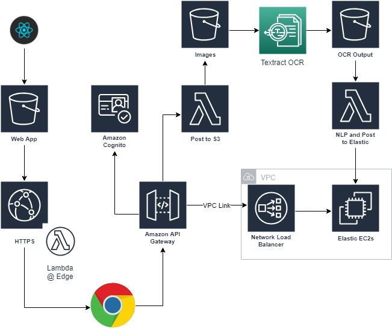

# RecipeFinder: A Serverless Data Flows, NLP, Elasticsearch in the Cloud Project

So I have far too many recipe cards...

Over the years, I have collected (read hoarded) hundreds of recipe cards from trips to the supermarket. I've generally kept them in folders so I can find them when I want but I want to do better. I'd love to be able search for them, find out commonly paired ingredients, work out cooking times.

Over the last few months, I have been working with serverless technologies in AWS both for hosting a secure HTML5 front end application and for ingesting and performing natural language processing on documents with the output being stored on [Elasticsearch](https://www.elastic.co/products/elasticsearch). We have had a lot of success with these technologies. I thought I could probably use some of these ideas and make a way to hold all my recipe cards and have some fun along the way pushing different AWS technologies.

Additionally, I'll want to use AWS technologies to secure the platform, take images in and OCR the content and allow me to find out more about all the recipes I have gathered!

## So Why Serverless Data Flows ...

So I've covered some of this before for [Azure Functions](https://jdunkerley.co.uk/2018/02/06/creating-a-simple-azure-function-in-javascript-with-vs-code/) and while have done a post [AWS Lambda](https://jdunkerley.co.uk/2019/01/08/creating-a-simple-aws-lambda-in-c/) haven't talked about Lambda's strengths recently. As mentioned in the Azure post, they have lots of benefits. The first one that normally comes up is cost - you get a chunky free allowance each month and it pay per use. Let's talk a bit more about the other benefits as cost is an easy one (centered on Lambda but generally applicable to all Functions as a Service (Faas) offerings).

Speed of delivery is amazing with Lambda. You manage only what matters to you. Before the public cloud, the chances are you would have needed to find a physical server to either buy and set up in a data center or rent one from a company that ran a data center. You had huge investment and commitment upfront before you have even started. One of the first services that was offered by AWS was EC2 (it launched in around March 2006). This meant you could get hardware in the cloud quickly and easily. However you still have to size and scale up front.

At this point, we have abstracted the hardware management but we still have to size and manage the OS and everything downwards. One possible next step of abstraction is to run things within containers. At first, in some ways this just add complexity now you have Docker running on a machine and still tons of stuff to manage. Fortunately, all three main cloud providers offer a container service ([ECS](https://aws.amazon.com/ecs/), [ACS](https://docs.microsoft.com/en-us/azure/container-service/), and [Google Contianers](https://cloud.google.com/compute/docs/containers/)). These are cloud native ways to run containers. This abstracts away some of running the machines and when combined with AWS Fargate or Azure Container Instances you no longer need to guess scale up front. Even at the container level there is still a lot to care about. The container will have a container OS and these base images will need managing and update. FaaS takes it one step further the OS and the runtime (e.g. Python, .Net Core) as manged for you. You just manage your application.

... Write More ...

## 10,000 Foot Plan

So this is my first thoughts on the architecture I want to build:

The front end will be build usine [ReactJS](https://reactjs.org/) and hosted in an S3 bucket behind a Cloud Front distribution to ensure only HTTPS access. The front end will be be authenticated using Cognito (probably backed off to a Facebook or other Web Identity Federation options). It will provide a way to upload an image to an S3 bucket.

The front end will also allow for searching the backend. My current view is to use Elasticsearch as a backend. This allows for a rich query syntax which we can use to search and find data. I plan to look at building a custom cluster from first basis just to go through the process. I will probably contrast it with using the Elasticsearch servce from AWS and also potentially look into DynamoDB as an alternative.

The last area and one of the most fun is to create a pipeline in Lambda trigger by S3 causing an OCR of the image followed by running through some NLP technologies. I haven't chose which tools to use here yet and again will be interesting to try a few different ways and see which ones are better or worse.

So that's the end architecture, but there is also the whole build and deployment technologies to play with. All the code will be hosted in GitHub. I plan to look at different options for building the code (such as Code Build or maybe even using Azure DevOps) and the various options for creating each piece (from using the CLI directly through to the Serverless Framework). 

## What's Next

So there's a lot of fun steps ahead, lots of fun technologies to play with and dive deep into from Lambdas, APIs, AI, NLP, Elastic to pick just a few. [Jan Akerman](https://janakerman.co.uk/) has agreed to join me on this journey and will be helping with the different tools and technologies as we go.

I'll try and do all this securely and with as much tips and tricks to help others as we go. My plan is to do this in a series of small focuesed posts. So first up will be to build an Elastic EC2 instance from the ground up.