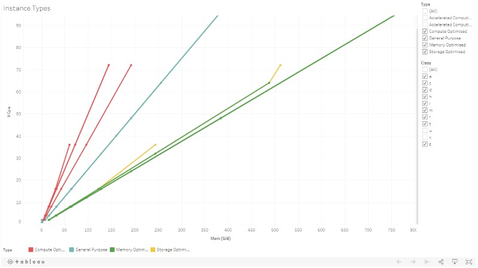
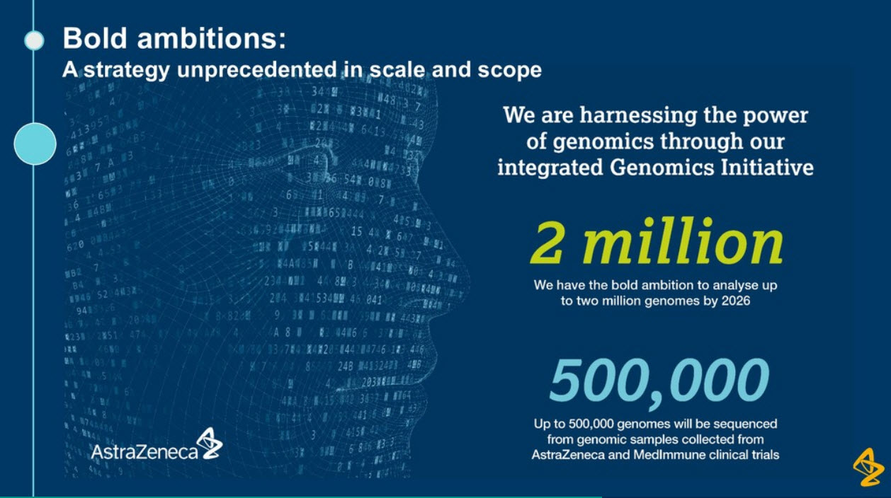
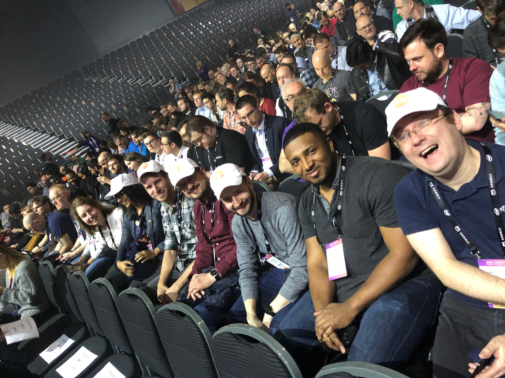

# AWS Summit London - 8th May 2019

A group of my colleagues from Scott Logic and I went to the AWS Global Summit at the ExCel centre this week. It is the biggest of the global summits, and gives a taste of the huge Re:Invent conference. This post is my thoughts from my day and the sessions I attended. There is a huge range of sessions (about 75) on offer, and this is just a taste from the ones I went to.

## Keynote ([YouTube](https://www.youtube.com/watch?v=77FiG0pZLJY))

The day started with an impressively quick registration process (last time took an age!) and a decent range of coffee and pastries before heading into the keynote. The keynote was presented by Matt Garman, VP of Compute Services at AWS, giving a overview of the current state of the AWS cloud. The platform continues to grow at an astounding rate with a annual run rate now approaching *31 billion* dollars a year, which is a 41% growth for last year.

Two of the customer case studies in the keynote were really interesting. The transormation that Sainsbury has been through has been huge and they talked over a lot of the gains they have had moving to a modern platform. The AI and ML capabilites have allowed them to do some impressive things with the Nectar data - aiming to provide a better customer experience. The Ministry of Justice talked about the work of the [Government Digital Services (GDS)](https://gds.blog.gov.uk). The `Cloud First` guidance is leading to HM Governemnt being huge users of the cloud and getting to adopt new technologies quickly.

The Keynote also highlighted two of AWS programs. The first, [AWS re:start](https://aws-restart.com/) gives training and placements to young people and military veterans who possibly havent had any experience of software engineering and gets them up to speed on technoliges and places them with companies. The second program was [AWS GetIt](https://aws.amazon.com/campaigns/aws-get-it/) which is a new initiative encouraging more girls to consider careers in technology.

## High Performance Computing (given by [Frank Munz](https://twitter.com/frankmunz)) - [Slides](https://speakerdeck.com/fmunz/high-performance-computing-on-aws-2019-with-astrazeneca)

There used to be a saying that in High Performance Computing (HPC), you were best to go away for 18 months and come back and the hardware would have increased so much you would make the time back! Moore's law, that number of transistors in dense circuit boards roughly doubles every two years, has held roughly true for decades. This means that the huge upfront capital expenditure needed to be machines for HPC has been a major blocker. The cloud compute model changes that entirely. You can 'rent' these machines just for the time you need.

Frank talked about five key areas you need to be aware of when doing HPC. These are listed below along with some of the associated AWS services.

1. Compute (EC2 Instances, Spot Instances, Autoscaling)
2. Storage (FSx Luster)
3. Networking
4. Automation and Orchestration
5. Visualisation

I was particularly intereseted in the extreme capabilities you can now get for EC2 instances. AWS offers a wide range of different machines, and you can now get machines with up to 12 TiB RAM (soon going to be 24TiB), very fast single cores (4GHz) and huge numbers of cores (the maximum is at least 96!).

One nice aside was the naming convention. Consider the instance type of `p3dn.24xlarge`. The breaks down in a variety of parts:

- `p`: This is the instance type. In this case general purpose GPU instances
- `3`: This is the generation of this type.
- `dn`: These represent the additional capabilities of the machine:
  - `d`: NVM3-based SSD disk used on the instance
  - `n`: Network speed boost to 100Gbs
- `24xlarge`: This is the specific size of the instance in the class. This is a huge machine with 96 virtual cores and 768 GiB of RAM!

[Tableau Public](https://public.tableau.com/profile/james.dunkerley#!/vizhome/Instances_15575213282580/InstanceTypes)

One capability which can be worth looking out for is the `a` suffix. This gives you an AMD EPYC processor instead of the Intel ones, but comes with a 10% cost saving. Depending on the workload this maybe an easy way to reduce cost.

Like all the break out sessions I attended, there was a customer case study. In this case it was AstraZeneca talking about their work on Genomics Research. The highlighted the challenges on HPC - specifically om premise performance capabilites and operational efficiency. The goal of their work is to quickly identify variations in a genome and load the results in to a database allowing for statistical analysis. The scale is enormous - they want to be able to analyse 20 million genomes, which would equate to about 10 Petabytes of data.

Interestingly they are using a lot of serverless technologies - both for compute and for storage. They talked about running 1,000s of process in parallel and using AWS Batch with FPGA instance where it was beyond the serverless technologies. The nature of the solution means they have very little running most of the time and it is only running when needed. The solution leads to a platform which is both operationally efficient and highly performant.

## CI/CD On AWS (given by [Danilo Poccia](https://twitter.com/danilop)) - [Slides](https://speakerdeck.com/danilop/cd-on-aws-ccd7a349-14f5-4647-861a-4ab3e9e0e000)

While I am a big fan of the benefits of CI/CD, I can't say I love the technologies provided by AWS. Danilo gave a great talk on the benefits starting from Infrastructure as code going through to Continuous Integration. 

Infrastructure as Code is a huge win. Having repeatable and controlled changes to the environment allows for rapid evolution and development while minimising the blast radius. Cloud Formation and the Serverless Application Model are core to AWS offering and they provide a strong foundation. This was the first time I had heard of [AWS Cloud Development Kit (CDK)](https://github.com/awslabs/aws-cdk) - it looks brilliant and moves from YAML/JSON configuration to code for defining infrastructure to using a programming language (e.g. TypeScript). One to play with soon.

AWS Code Pipeline is it's offereing for continuous integration (CI). This allows for various triggers (such as GitHub and CodeCommit) and sources (including webhooks which are a recent addition as a trigger). This can trigger CodeBuild which allows for building of the code. It is controlled by a yaml file allowing easy defintion of different build processes.

The final piece of the puzzle AWS offer is Code Deploy it's continuous deployment (CD). Originally this just target EC2, but over the years its outputs have been expanded over and over. The hooks built into it allow for you to call lambda at various points and verify things before proceeding. Again the awslabs have a great [repo](https://github.com/awslabs/aws-deployment-framework) walking through the options.

[Tonino Greco](https//twitter.com/toninog) from Dunelm gave a great overview of the success they have had creating a CI/CD pipeline for their tribes. They use various additional technologies to create an impressive pipeline including Jenkins, Ansible and various serverless technologies. The central management of the build tools has allowed for process that is well auditted and has various security and verification steps built in. They include a nice integration with slack as well allowing the teams easy monitoring and control.

## Modern Cloud Architecutres - 

- Innovate as rapidly as possible
  - Try lots of experiments
  - Reduce 'collateral damage' from failed experiment (CapEx not held, release resources)
- IT landscape has changed
  - Lots of interfaces and channels direct to end users (customers)
  - Become data driven
  - Rapid rate of change, innovation
- Core capabilities
  - Security
  - Resiliance (expected and unexpected failyre)
  - Elastic (scale up and down easily)
  - Modular
  - Automated (run and reverse experiments quickly and easily)
  - Interoperable
- Often not green field
  - Lift and shift (re-host) through to redesign (re-invent)
- Finra: Serverles stock trade verification service
  - 3 months to develop
  - Huge cost reduction
  - Only running when market is open
- Checklist:
  - Enable Security and Compliance across the entire app lifecycle
    - Durning both development cycle and running in live
  - Structure apps as a collection of microservices
    - Velocity and scaling
    - Can lead to organisational changes, lots of small teams working on small pieces (Conways Law)
    - Event driven architectures
  - Databases in modern applications
    - Relational or not? Strong consistency, normalisation
    - Use the database technology appropriate for choice
  - Build with serverles technologies as much as possible
    - Avoid heavy lifting of creating or managing environments
    - Concentrate on the value add code
    - For event driven, use functions as a service
    - For long running, look at Fargate for serverless containers
    - If need more control, options are there and can be added as needed
 - Infrastructure as Code
    - Only provision resources using code (services like Cloud Formation or Terraform)
    - Treat as source code
    - Declaritive state of what you want to be there (state diffed and updated)
    - Chagnes repeatable and predictable
    - Easy to build developer and test environments
 - SAM
    - IaC for serverless
    - Open source
    - Yaml definition
    - SAM CLI
    - Local development environment
  - Rapidly iterate with CI/CD tools
    - Ship more core faster with more confidence
    - Typically one pipeline per service
    - Feedback => Ideas => Experiemnt 'Innovation Flywheel'
  - Use monitoring to optimise end user experience
    - Complexity comes with Microservices
    - X-Ray for tracing
    - AWS Cloud Map to track estate

## Stream Processing and managing Real Time Data (Javier Ramirez - @supercoco9)

- Challenges of data streaming
  - Set up
  - Scaling
  - High availability
- AWS streaming on cloud
  - Various tech on platform but managed by AWS
  - AWS Managed Streaming for Kafka (v1.1.1/v2.1.0)
  - Flink on top of Kinesis Data Analytics
  - Managed ElasticSearch as the query engine
- Kinesis is fundamental service (billing and cloudwatch)
  - Serverless platform - play for traffic in the stream
  - Lambda for transform (e.g. Apache Log to JSON) but some built in already
- Streams vs Firehose
  - Latency on streams is much lower, Firehose up to 60 seconds
  - Data streams can have server based applications
  - Data streams very like Kafka, allows replay of events
  - Data streams need number of shards
    - Can use cloud watch alarms to auto scale up and down
    - Not fully automatically (still a lot easier than Kafka with physical hardware)
    - Library in awslabs
  - Can mix and match (e.g. Firehose takes Stream as an input or vice versa)
- Analytics
  - Interact with streams in real time with SQL or Java applications (Apache Flink)
  - SQL allows for rolling windows (either overlapping or not)
  - Stream joined to static data
  - Fully managed and elastic

- NYC TLC Trip Record Data

Real time analytics at HSBC (Prakash Sethuraman)

- Scale (169PB data, trillions of dollars every day) and Diversity (global nature)
- What and How at Re-Invent 2018
- Moved from batch to stream processing
- Legacy main frame for golden source, aim to get to modern cloud stores
- Direct connect from DC to AWS
- Deliver to mobile apps
- Kinesis allows them to keep it flexible, no large capex, chop and change as needed
- Use Kafka within the DC  (Change Data Capture)
- Then through NiFi (choosen for throughput) ==> push out rather than reach in
- Store duplicated data to allow for faster responses
- Failed experiments can be switched of (hard in a bank...)
- Roughly 0.5BB messages with 0.25BB events
- All secure from the beginning, users have to come back in to get the details
- DLS (SNS/SQS)
- Lambda Latencies (spin up time, ENIs - reuse where possible)
- Design of VPC
- Eaxctly once processing is hard

## Deep Dive on Serverless

Comic Relief gave an awesome overview of their platform.

## Wrapping Up

It was great to spend a day immersed in AWS. The cloud technologies continue to grow at an incredible rate, with new concepts and technologies all the time. The summit gave us a great chance to be buried in what people are doing and see successful implementations of various customers. I think one of the big aspects that was emphasised by various of the real world case studies, is that the cloud combined with CI/CD technologies allow for a very fast innovation cycle where we shouldn't be scared to have failed experiments as the cost and blast radius is very small.

