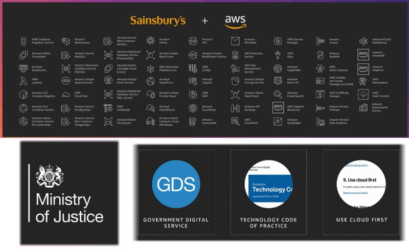
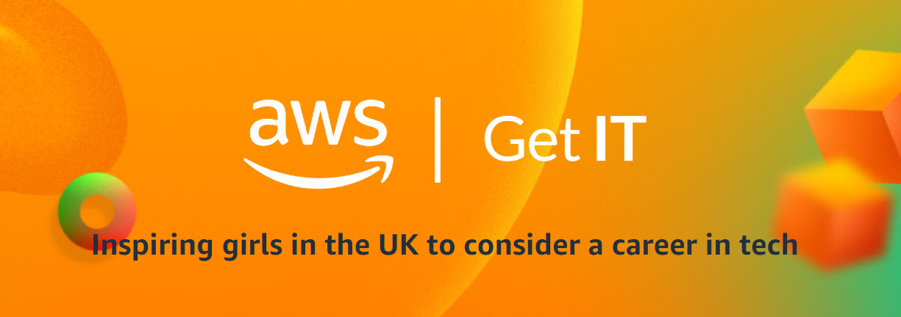
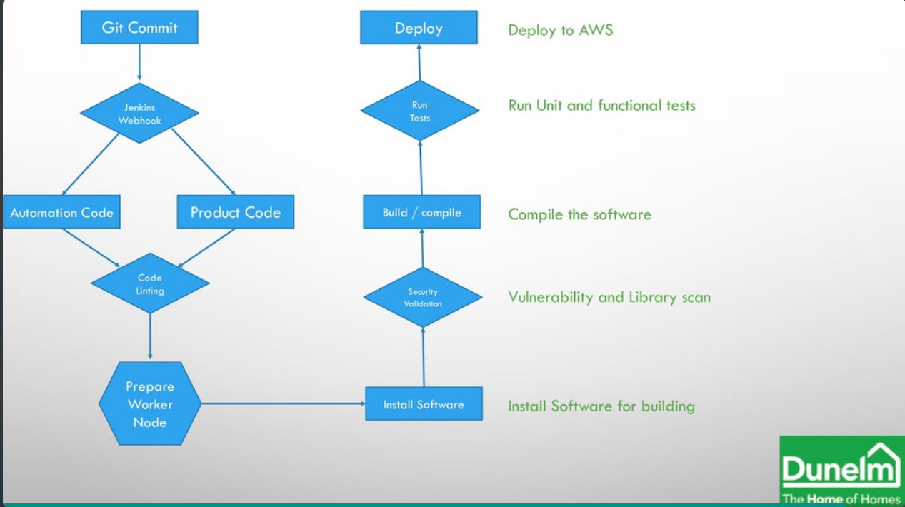
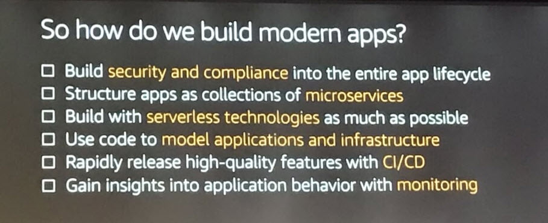
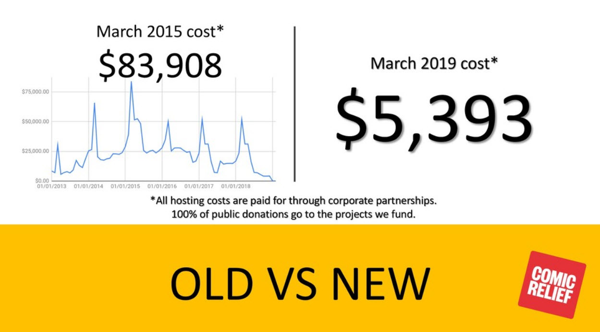

# AWS Summit London - 8th May 2019

A group of my colleagues from Scott Logic and I went to the AWS Global Summit at the ExCel centre this week. It is the biggest of the global summits, and gives a taste of the huge re:Invent conference in Las Vegas. This post is my thoughts from my day and the sessions I attended. There is a huge range of sessions (about 75) on offer, and so this is just a taste from the ones I went to.

*You can also read my colleagues [Zinat Wali's summary](https://blog.scottlogic.com/2019/05/10/aws-summit-london-2019.html) on [Scott Logic's Blog](https://blog.scottlogic.com/)*

## Keynote ([YouTube](https://www.youtube.com/watch?v=77FiG0pZLJY))

The day started with an impressively quick registration process (last time took an age!) and a decent range of coffee and pastries before heading into the keynote. The keynote was presented by Matt Garman, VP of Compute Services at AWS, giving an overview of the current state of the cloud. The platform continues to grow at an astounding rate with an annual run rate now approaching *31 billion* dollars a year, which is a 41% growth for last year.

Two of the customer case studies in the keynote were particularly interesting. The transformation that Sainsbury has been through has been huge and they talked over a lot of the gains they have had moving to a modern cloud based architecture. The AI and ML capabilities have allowed them to do some impressive things with the Nectar data - aiming to provide a better customer experience. The Ministry of Justice talked about the work of the [Government Digital Services (GDS)](https://gds.blog.gov.uk). The 'Cloud First' guidance is leading to HM Government being huge users of the cloud and getting to adopt new technologies quickly.

The Keynote also highlighted two of AWS programs. The first, [AWS re:Start](https://aws-restart.com/) gives training and placements to young people and military veterans who possibly haven't had any experience of software engineering and gets them up to speed on technologies and places them with companies. The second program was [AWS GetIT](https://aws.amazon.com/campaigns/aws-get-it/) which is a new initiative encouraging more girls to consider careers in technology.

## High Performance Computing (given by [Frank Munz](https://twitter.com/frankmunz)) - [Slides](https://speakerdeck.com/fmunz/high-performance-computing-on-aws-2019-with-astrazeneca)

There used to be a saying that in High Performance Computing (HPC), you were best to go away for 18 months and come back and the hardware would have increased so much you would make the time back! Moore's law, that number of transistors in dense circuit boards roughly doubles every two years, has held roughly true for decades. This means that the huge upfront capital expenditure needed to be machines for HPC has been a major blocker. The cloud compute model changes that entirely. You can 'rent' these machines just for the time you need.

Frank talked about five key areas you need to be aware of when doing HPC. These are listed below along with some of the associated AWS services.

1. Compute (EC2 Instances, Spot Instances, Autoscaling)
2. Storage (FSx Luster)
3. Networking
4. Automation and Orchestration
5. Visualisation

I was particularly interested in the extreme capabilities you can now get for EC2 instances. AWS offers a wide range of different machines, and you can now get machines with up to 12 TiB RAM (soon going to be 24TiB), very fast single cores (4GHz) and huge numbers of cores (the maximum is at least 96!).

One nice aside was the naming convention. Consider the instance type of `p3dn.24xlarge`. The breaks down in a variety of parts:

- `p`: This is the instance type. In this case general purpose GPU instances
- `3`: This is the generation of this type.
- `dn`: These represent the additional capabilities of the machine:
  - `d`: NVM3-based SSD disk used on the instance
  - `n`: Network speed boost to 100Gbs
- `24xlarge`: This is the specific size of the instance in the class. This is a huge machine with 96 virtual cores and 768 GiB of RAM!

[Tableau Public](https://public.tableau.com/profile/james.dunkerley#!/vizhome/Instances_15575213282580/InstanceTypes)

One capability which can be worth looking out for is the `a` suffix. This gives you an AMD EPYC processor instead of the Intel ones but comes with a 10% cost saving. Depending on the workload this maybe an easy way to reduce cost.

Like all the breakout sessions I attended, there was a customer case study. In this case it was AstraZeneca talking about their work on Genomics Research. The highlighted the challenges on HPC - specifically, on premise performance capabilities and operational efficiency. The goal of their work is to quickly identify variations in a genome and load the results into a database allowing for statistical analysis. The scale is enormous - they want to be able to analyse 20 million genomes, which would equate to about 10 Petabytes of data.

Interestingly they are using a lot of serverless technologies - both for compute and for storage. They talked about running 1,000s of process in parallel and using AWS Batch with FPGA instance where it was beyond the serverless technologies. The nature of the solution means they have very little running most of the time and it is only running when needed. The solution leads to a platform which is both operationally efficient and highly performant.

## CI/CD On AWS (given by [Danilo Poccia](https://twitter.com/danilop)) - [Slides](https://speakerdeck.com/danilop/cd-on-aws-ccd7a349-14f5-4647-861a-4ab3e9e0e000)

While I am a big fan of the benefits of CI/CD, I can't say I love the technologies provided by AWS. Danilo gave a great talk on the benefits starting from Infrastructure as code going through to Continuous Integration. 

Infrastructure as Code is a huge win. Having repeatable and controlled changes to the environment allows for rapid evolution and development while minimising the blast radius. Cloud Formation and the Serverless Application Model are core to AWS offering and they provide a strong foundation. This was the first time I had heard of [AWS Cloud Development Kit (CDK)](https://github.com/awslabs/aws-cdk) - it looks brilliant and moves from YAML/JSON configuration to code for defining infrastructure to using a programming language (e.g. TypeScript). One to play with soon.

AWS Code Pipeline is its offering for continuous integration (CI). This allows for various triggers (such as GitHub and CodeCommit) and sources (including webhooks which are a recent addition as a trigger). This can trigger CodeBuild which allows for building of the code. It is controlled by a yaml file allowing easy definition of different build processes.

The final piece of the puzzle AWS offer is Code Deploy for continuous deployment (CD). Originally this just targetted EC2, but over the years its outputs have been expanded over and over. The hooks built into it allow for you to call lambdas at various points and verify things before proceeding. Again the awslabs have a great [repo](https://github.com/awslabs/aws-deployment-framework) walking through the options.

[Tonino Greco](https//twitter.com/toninog) from Dunelm gave an overview of the success they have had creating a CI/CD pipeline for their developer tribes. They use various additional technologies to create an impressive pipeline including Jenkins, Ansible and various serverless technologies. The central management of the build tools has allowed for process that is well audited and has various security and verification stages built in. They include a nice integration with slack as well allowing the teams easy monitoring and control.

## Modern Cloud Architectures (given by [Ian Massingham](https://twitter.com/IanMmmm))

Ian gave an interesting talk about building an application using modern cloud architectures. The new IT landscape has a rapid rate of change and innovation, with business becoming increasingly data driven. You need to be able to try lots of experiments and be prepared to fail. The cloud makes it easy to reduce 'collateral damage' from failed experiment - especially as there is no need for large up-front expenditure on hardware.

This talk went through a checklist of points to help build moderns apps. As has been a theme with AWS for years, Security is the top priority and needs to be considered from the start of a project through to it running in production. Then moving through both microservices and serverless technologies. It also covered some similar ground to the CI/CD one.

One final area that is often overlooked is gaining insights into your applications from monitoring and using this to help optimise the user experience. A couple of AWS services - X-Ray and Cloud Map were highlighted to help here.

A quick shout out to Ann Ledwith from Sage for giving the customer demo. She was the only one that I saw who did an actual live demo rather than just having slides - and happily it all worked.

## Stream Processing and managing Real Time Data (given by [Javier Ramirez](https://twitter.com/supercoco9))

Javier gave us an overview of some of the challenges typically faced when wanting to work with streaming data, from the initial setup, though to making it scale and be highly available. AWS has various technologies to make this easier. There was a decent overview of Kinesis, both Streams and Firehose, and when and where you might want to use them. He also spoke about AWS Managed Streaming for Kafka. From what I have seen of MSK, it is still a very young service and not quite ready for production yet (doubt it will be long before it is though).

I have been impressed by the power and simplicity of Apache Flink from when I first saw it. The ability to use it on top of Kinesis Analytics just makes for a fantastic easy way to transition to the cloud for streaming. With the ability to link to connect Kinesis to Kafka and vice versa AWS have built a very flexible streaming platform to build on top of.

The customer story was about real time analytics at HSBC, presented by Prakash Sethuraman. They have an enormous scale (169PB data, trillions of dollars every day) and diversity of data (from their global nature). He talked about the range of technologies they are using, and the security decisions that shaped some of the design.  Like various other speakers, they highlighted to ability to try things and not be worried to fail, as unlike inside a bank they can easily be turned off. A really interest speaker and work watch the longer how to from [re:Invent](https://www.youtube.com/watch?v=_UiyIJqDXXQ).

## Deep Dive on Serverless (given by [Danilo Poccia](https://twitter.com/danilop)) - [Slides](https://speakerdeck.com/danilop/serverless-functions-deep-dive-90fc7749-a01b-4832-b337-9720fa80df11)

This final talk of the day I went to was again given by Danilo Poccia. It was a great overview of serverless functions, talking over all the basics of building Lambdas as well as covering the special features only present in AWS (such as layers). I have spent a little time playing with the custom runtime API, and it was great to see the details on display here. The deep dive went into a lot on SAM and deployment strategies.

The final case study was given by [Caroline Rennie](https://twitter.com/cagsr89) of Comic Relief. It gave an awesome overview of their serverless journey and how it copes with the huge spike in demand that the Comic Relief night brings. I think it is best summed up by:

## Wrapping Up

It was great to spend a day immersed in AWS. The cloud technologies continue to grow at an incredible rate, with new concepts and technologies all the time. The summit gave us a great chance to be buried in what people are doing and see successful implementations of various customers. I think one of the big aspects that was emphasised by various of the real world case studies, is that the cloud combined with CI/CD technologies allow for a very fast innovation cycle where we shouldn't be scared to have failed experiments as the cost and blast radius is very small.

As always with these kinds of conferences, you hopefully come away enthused with passion for it all. While I doubt I will use everything I saw today, the ideas and experience lead to lots of new avenues.

*Quick shout out to Office Lens - it's a great free app that takes misaligned screenshot and makes them square again*