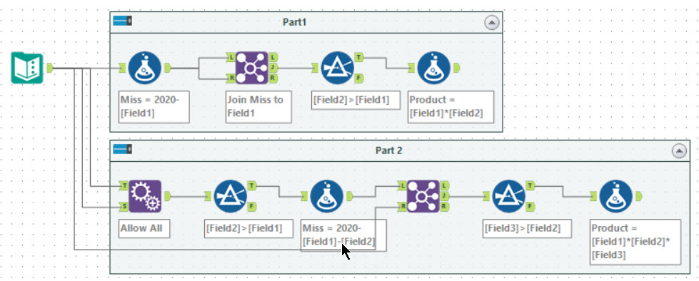
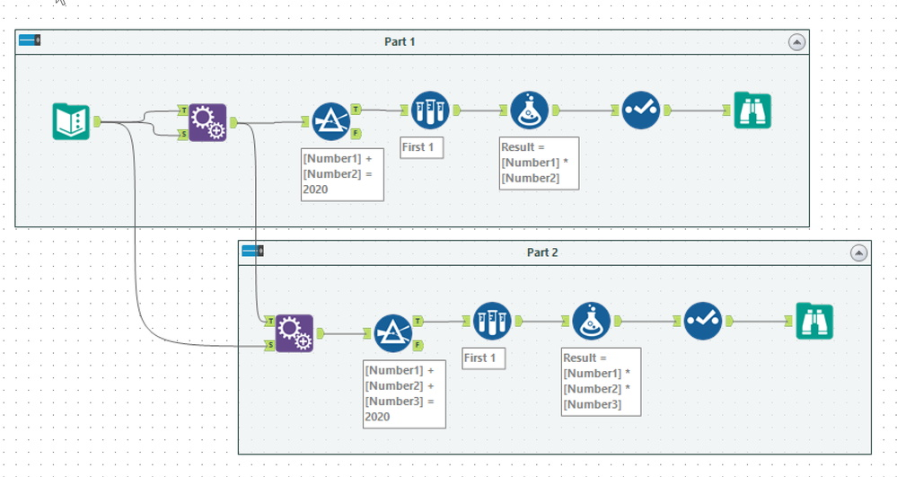
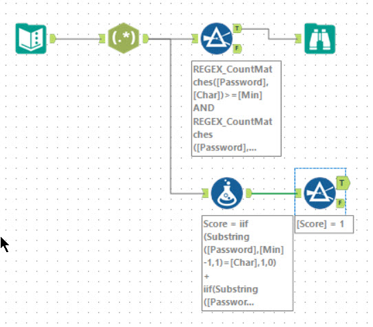
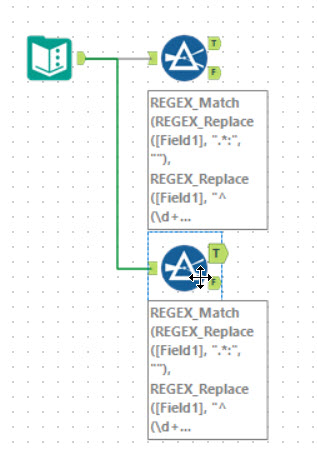
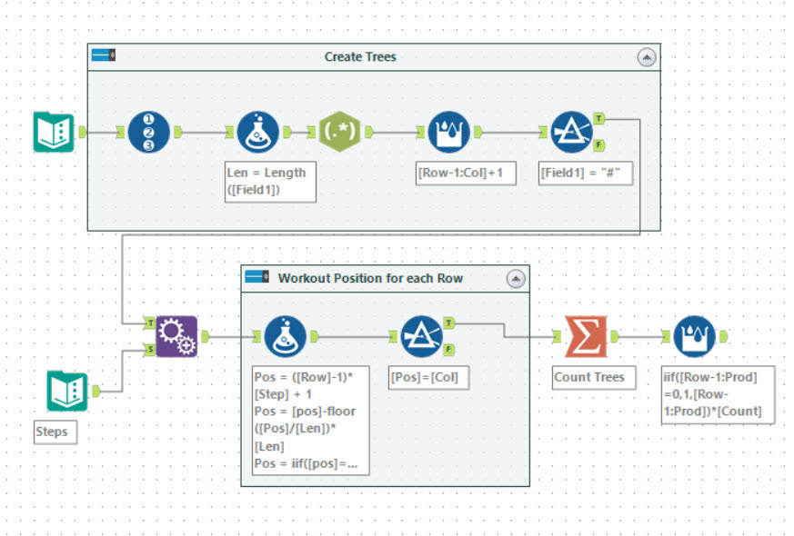
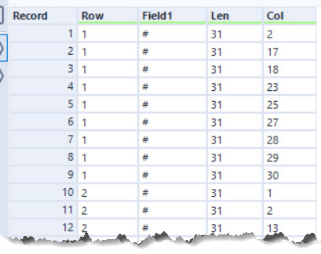
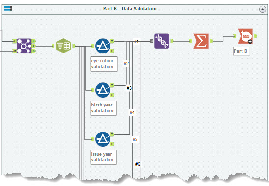

# Alteryxing The Advent of Code 2020 - Week 1


So it's December and time again for the annual [Advent of Code](https://adventofcode.com/2020). For those not familiar, this is a set of 25 puzzles (each with 2 parts) set by [Eric Wastl](http://was.tl/). They have a Christmas theme and story and are solvable with just a little programming knowledge and some puzzle-solving skills. The puzzles start quite easy and get increasingly more complicated, and part 2 can often be a lot harder.

A couple of years ago, [Adam Riley](https://twitter.com/AlteryxAd/status/1069619208865107969?ref_src=twsrc%5Etfw) suggested we try solving them in Alteryx and so a new annual tradition began. It is worth noting that the puzzles do not necessarily suit Alteryx, but trying to think about how to solve them is a great chance to sharpen your skills. We created some rules - solving using BaseA:


- No RunCommand tool
- No Python tool
- No R tool
- No SDK based Custom Tools (macros are fine)
- No Formula SDK extensions
- Download tool allowed for downloading (no posting to APIs to get answers from!)

If you want to join us, we have an Alteryx leaderboard you can join by going to https://adventofcode.com/2019/leaderboard/private and using the code `453066-ca912f80`. We are chatting on the Alteryx Community under the [Advent of Code label](https://community.alteryx.com/t5/forums/filteredbylabelpage/board-id/general-discussions/label-name/advent%20of%20code). The leaderboard awards points by order in which they are solved. As the puzzles are published at midnight Eastern time, this gives those who live on the West Coast an advantage. Those of us in the UK, it's 5 am, which is not a good time for my brain at least! Generally, this means it is fairest to look at total stars rather than points.

For this year, I thought I would write up my solutions with some alternatives solutions from other people every week (well at least while we succeed in solving them!). When building a workflow, there are a couple of other dimensions we can look at beyond just working: how fast is the workflow and 'Tool Golf' (i.e. how few tools can we use)! So I will try and pick different approaches to my own for each day.

# [Day 1 - Report Repair](https://adventofcode.com/2020/day/1)
- [Community Discussion](https://community.alteryx.com/t5/General-Discussions/Advent-of-Code-2020-BaseA-Style-Day-1/m-p/675532)


*Tools used: 10, run-time: 0.3s*

So for this puzzle, you need to find the pair of numbers which totalled 2020. I chose to work out the second number for each input row (a new column `Miss`), I can then join this to itself (on `Miss=Field1`) to find the valid possibilities. I then used a filter tool to pick when `Miss` is greater than `Field1` to get a unique solution. Finally, I computed the product with another formula tool.

For part 2, you need to do the same but with three numbers. First, I chose to make all possible pairs using an Append Fields tool (set to allow all appends). After this, the process is similar to compute the missing third number and join.

For best 'tool golf', I could have merged a lot of this into the formula tool (doing the comparison and only producing a `Miss` if fields will be in order) and then join tool would produce a unique result.

## All Possible Combinations



This solution belongs to [@JeanBalteryx](https://community.alteryx.com/t5/user/viewprofilepage/user-id/77398). In this case, first, he creates all possible pairs (again using Append Fields tool) and then filters to the pairs where the total is correct. Using a Sample tool, you get a single unique answer which you then compute the Result on (using the formula tool). He also tidies up the data using a Select tool and puts the results into a Browse tool (mostly I choose to rely on Browse Anywhere for Advent of Code).

For part 2, the process starts from the full set of pairs using another Append Fields tool to get the complete set of triplets. After this performing the same filtering and sampling to produce the required result.

# [Day 2 - Password Philosophy](https://adventofcode.com/2020/day/2)
- [Community Discussion](https://community.alteryx.com/t5/General-Discussions/Advent-of-Code-2020-BaseA-Style-Day-2/m-p/675534)


*Tools used: 5, run-time: 0.4s*

And so we enter the world of [Regular Expressions](https://xkcd.com/1171/). First, using a Regex tool to parse the input into columns. An expression of `(\d+)-(\d+) (.): (.*)` will break it out into 4 columns:

- `Min`: The first number
- `Max`: The second number
- `Char`: Character
- `Password`: Password to check.

I then fed this into the filter tool using `REGEX_CountMatches` to count the number of times the specified character occurs: `REGEX_CountMatches([Password], [Char])` and can then compare with `Min` and `Max` to determine valid matches.

For part 2, I relied on the simple `Substring` function to find the characters to compare. Watch out for the [off by 1 error](https://twitter.com/codinghorror/status/506010907021828096?lang=en) - my brain wasn't working well at the time when I was building it and became off by 2 before realigning!

## Regex For The Win



For this puzzle, I had to choose [Ned Harding](https://community.alteryx.com/t5/user/viewprofilepage/user-id/149440)'s solution. He won the 'tool golf' challenge with a score of 2 tools! **But this is not for the faint of heart!** Using `REGEX_Replace`, he constructs the regular expression for a `REGEX_Match` in the filter tool:

```
REGEX_Match(REGEX_Replace([Field1], ".*:", ""),
	REGEX_Replace([Field1], "^(\d+)-(\d+) (.).*$", "^[^$3]*\($3[^$3]*\){$1,$2}$"))
```

The first `REGEX_Replace` replaces up to and including the `:`. The second takes the `1-8 n` and turns it into `^[^n]*(n[^n]*){1,8}$`. This will ignore everything until the first `n` and then match between 1 and 8 blocks each starting with an `n`, and then followed by some non `n` characters. The `^` and `$` mean it must be the whole password.

For part 2, the formula becomes:

```
REGEX_Match(REGEX_Replace([Field1], ".*:", ""), 
	REGEX_Replace([Field1], "^(\d+)-(\d+) (.).*$", "\(^\(?=.{$1}[^$3]\)\(?=.{$2}$3\).*$\)|\(^\(?=.{$1}$3\)\(?=.{$2}[^$3]\).*$\)"))
```

In this case, the input `1-8 n` is turned into `(^(?=.{1}[^n])(?=.{8}n).*$)|(^(?=.{1}n)(?=.{8}[^n]).*$)`. This is a substantially more complicated expression. It consists of 2 scenarios separated by a `|`, I will look at just the first part as the second just flips the 1 and 8. The first case is looking for when the 1st character is not `n`, and the 8th character is `n`. The `(?=.{1}[^n])` is a positive lookahead checking that the character at second character is not `n`. Note to correct for the off by 1 problem; Ned kept a leading space. The second block `(?=.{8}n)` is a second positive lookahead checking that character 8 is an `n`. The `.*` then matches the entire string as long as both lookaheads were fulfilled.

Some very clever regular expressions in here but not simple!

# [Day 3 - Toboggan Trajectory](https://adventofcode.com/2020/day/3)


- [Community Discussion](https://community.alteryx.com/t5/General-Discussions/Advent-of-Code-2020-BaseA-Style-Day-3/m-p/675538)


*Tools used: 11, run-time: 0.4s*

In this puzzle, we are given a map of where the trees are. I chose to turn this into a list of trees with their Row and Column co-ordinates. I used a useful trick of a Regex tool in parse more with an expression of `.` to break each character into a row.



Having got this list of trees, you can then filter it to cases where the column is equal to the `MOD((Row - 1) * Step + 1, Len)`, where `Len` is the length of the input string. For case 1, the step is 2. This works well for all but one of the case 2 scenarios too. In the case of 2 rows for 1 column, you need to amend the expression a little more. I chose to use to make the `Pos` a double and reproduce the `MOD` function but the following 3 steps:

```
Pos=([Row]-1)*[Step] + 1
Pos=[Pos]-floor([Pos]/[Len])*[Len]
Pos=iif([Pos]=0,[Len],[Pos])
```

Having produced this value, you can filter it for when the `Pos=Col`. Finally, a summarize tool and a multi-row formula allow the computation of the counts and the product.

## Substrings


[Danilang](https://community.alteryx.com/t5/user/viewprofilepage/user-id/34059)'s solution is a nice improvement to my approach. Instead of parsing the input into a row-based data, he used the `Substring` function to pick the specific character out.

Additionally, he chose to use a `RowSkip` so every other row is removed in the specific 2-row case. This is cleaner than switching to use a floating-point number. It would allow a cleaner expression to get the character:

```
substring([Field_1],
  MOD([RecordID]/[RowSkip]*[Offset],length(trim([Field_1]))),
  1)
```

A nice clean solution and with a win of 7 in Tool Golf!

# [Day 4 - Passport Processing](https://adventofcode.com/2020/day/4)

- [Community Discussion](https://community.alteryx.com/t5/General-Discussions/Advent-of-Code-2020-BaseA-Style-Day-4/m-p/675657)


*Tools used: 9, run-time: 0.3s*

So we're back in the land of RegEx. There are a set of fields we need to parse and determine if they are valid. This is a perfect use case for `REGEX_Match`.

The first task of this puzzle is to read the input and identify when each record ends, and the next one begins. This is identified by a `null` line (worth noting I had an odd defect when copy and pasting from the input into Alteryx and the empty rows were skipped). After this, using a Regex tool in tokenise mode with an expression `(...:\S+)` breaks each field out into its own row. In retrospect, this would have been simpler done using a Text to Column tool with a separator of ` `. After this, I chose to use a formula tool to split into `Field` and `Value` (again easier to do with a Text to Columns):

```
Field=left([Field1],3)
Value=Substring([Field1],4,1000)
```

For part one, it's just a case of counting the number of matching valid fields (ignoring the `cid` field for simplicity). For part 2, we need to move on to validating the actual value. I chose to use a Find and Replace to append a validation regex. The image below shows the expressions I used:


I was in the mood to do everything within the regex. This meant I didn't need to do any range checks on top as it was all built into these expressions. So, for example, to check for a 4 digit year from 1920 to 2002 becomes `19[2-9]\d|200[0-2]`. The first part (`19[2-9]\d`) deals with all values from 1920 to 1999 and the second (`200[0-2]`) deals with the last 3 years needed.

## No Regex


[CGoodman3](https://community.alteryx.com/t5/user/viewprofilepage/user-id/21515) took almost the opposite approach to me and entirely avoided using Regex. He used a Text to Columns tool to break up the input into separate rows. This section shown above solves part 1 and is quite similar to my approach.



For part 2, Chris chose to implement a filter tool for each expression. A couple of examples of these are shown below:

```
Eye Colour:
   [Concat_Field_11] = "ecl" 
   AND [Concat_Field_12] IN ("amb","blu","brn","gry","grn","hzl","oth")

Issue Year:
   [Concat_Field_11] = "iyr" 
   AND [Concat_Field_12] >= "2010" AND [Concat_Field_12] <= "2020"

Height: 
   [Concat_Field_11] = "hgt"
   AND 
     (
       (right([Concat_Field_12],2) = "in" 
       AND tonumber(left([Concat_Field_12],length([Concat_Field_12])-2)) >= 59
       AND tonumber(left([Concat_Field_12],length([Concat_Field_12])-2)) <= 76)
     OR 
       (right([Concat_Field_12],2) = "cm"
       AND tonumber(left([Concat_Field_12],length([Concat_Field_12])-2)) >= 150
       AND tonumber(left([Concat_Field_12],length([Concat_Field_12])-2)) <= 193)
     )
```

One advantage of this approach is that each expression is simple and easy to debug. Each filter deals with one type of field, and then the valid results can be joined together using a Union tool.

# [Day 5 - Binary Boarding](https://adventofcode.com/2020/day/5)

- [Community Discussion](https://community.alteryx.com/t5/General-Discussions/Advent-of-Code-2020-BaseA-Style-Day-5/m-p/676290)


*Tools used: 4, run-time: 0.3s*

Day 5's problem is the description of the binary representation of an integer with 10 bits, with `F` and `L` being `0` and `B` and `R` being `1`. Alteryx has a 'BinToInt' function which takes a binary string and converts to an integer. So the unique seat id is given by:

```
BinToInt(
ReplaceChar(ReplaceChar(ReplaceChar(ReplaceChar(
     [Field1], "B", "1"),
     "R", "1"),
     "F", "0"),
     "L", "0"))
```

There is no need to treat Row and Column separately as the expression combining the two is the same as a 10-bit integer. To find the missing value, I computed the `Next` seat and joined the data to itself. The `L` output then returns 2 rows - the missing row and the final seat.

## Alternative...

# Wrapping Up

So that's week one (well first 5 days) down. Generally, these puzzles have been well suited to Alteryx. If you want to take a deeper look at my solutions, they are posted to [GitHub](https://github.com/jdunkerley/adventofcode/). A few other git repositories are listed below:

- NicoleJohnson: https://github.com/AlteryxNJ/AdventOfCode_2020
- ColoradoNed: https://github.com/NedHarding/Advent2020
- CGoodman3: https://github.com/ChrisDataBlog/AdventOfCode_2020

As it stands, the leaderboard looks like:


Let's see what week 2 brings...