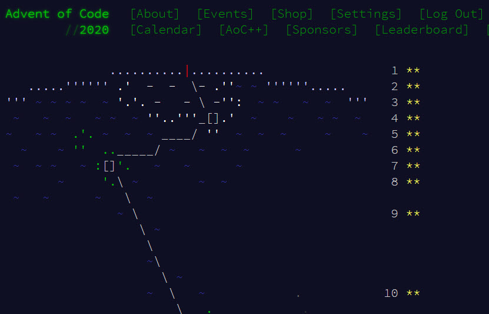
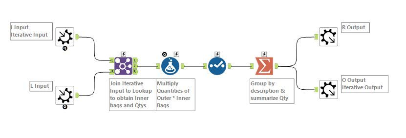
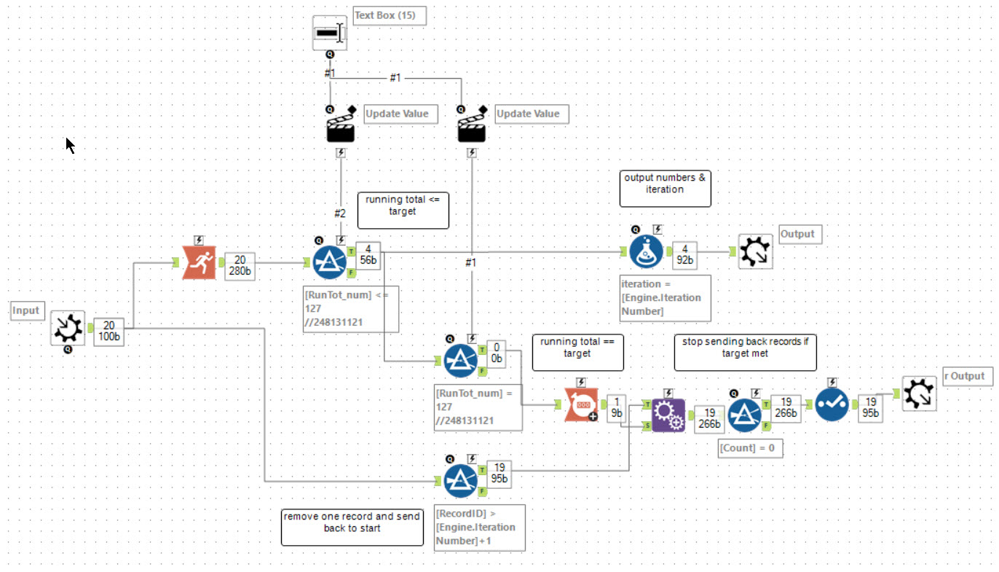
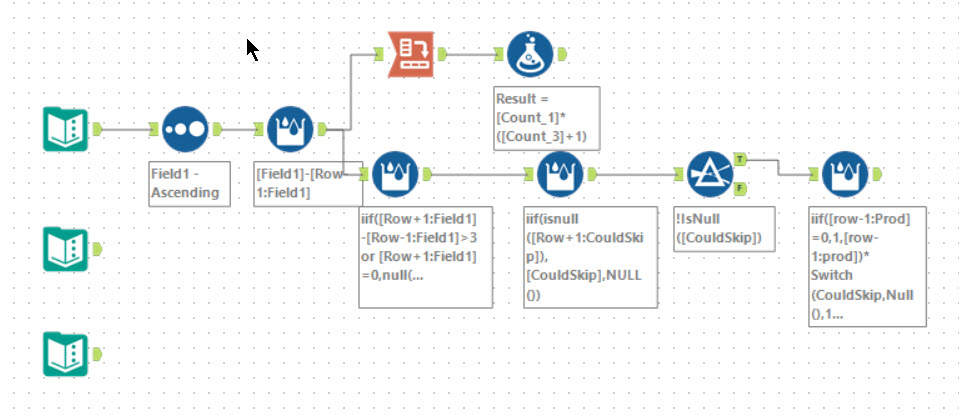

# Alteryxing The Advent of Code 2020 - Week 2



So [week 1](https://jdunkerley.co.uk/2020/12/05/alteryxing-the-advent-of-code-2020-week-1/) was well suited to Alteryx, let's see how week 2 unfolded! A nice and gentle Sunday puzzle lulled me into the belief that it was going to be an easy week, followed by the first needed use of an iterative macro, and then something that looked far too much like the dreaded [IntCode of 2019](https://adventofcode.com/2019/day/2)...

As with last week, I've picked some examples from around the community for different approaches to my own. This week also saw a [useful macro](https://github.com/NedHarding/Advent2020/blob/main/AdventOfCodeInput.yxmc) by Ned Harding which will download and parse the input from the Advent of Code site. I also played with a version of this, which will [download the leaderboard](https://github.com/jdunkerley/adventofcode/blob/master/Build%20Leaderboard.yxmd) so I could play with the results - and see if anyone had beaten Nicole Johnson yet!

Some of the puzzles this week involve some complicated workflows so I will do my best to explain them as clearly as I can. Where I can't find a substantially different approach (or don't understand the other one!) I haven't included below.

## [Day 6 - Custom Customs](https://adventofcode.com/2020/day/6)
- [Community Discussion](https://community.alteryx.com/t5/General-Discussions/Advent-of-Code-2020-BaseA-Style-Day-6/m-p/676470)


*Tools used: 6, run-time: 0.2s*

A well-suited problem for Alteryx. First, using a multi-row formula tool to identify each group, with the `null` rows delimiting when a group ends. The old trick of a Regex tool in tokenise mode with an expression of `.` will break each character into a separate record. A summarise tool grouping by `Group` and `Char` will produce a record for each meaning the answer for part 1 is just the row count.

For part 2, you need to know how many people are in each group and then join this with those characters within that group which has the same count. This can easily be done using a Join tool on `Group` and `Count`, with the `J` output record count answering part 2.

There weren't any real alternative approaches to this one. A few people used a Unique tool for part 1 to produce a unique set.

## [Day 7 - Handy Haversacks](https://adventofcode.com/2020/day/7)
- [Community Discussion](https://community.alteryx.com/t5/General-Discussions/Advent-of-Code-2020-BaseA-Style-Day-7/m-p/676704)


*Tools used: 22 (including iterative macro), run-time: 3.6s*

This is a fairly classic problem of needing to build and walk a hierarchy. For my solution, I chose to use an Iterative macro to fold up leaf nodes into the parent and then remove. So the first task as always is to parse the input - so back to the usual Regex and Text to Columns tools to produce something like:


Each row represents a parent and child (with the count for the child). My iterative macro selects the `Outer` colours whose `InnerColour` are not in the Outer list (the leaf of the network as it stands). These rows are then written out to the output. Additionally, their children are copied into their parent nodes and scaled by the `InnerNumber` so for example:

```
shiny gold	1	dark olive
shiny gold	2	vibrant plum
dark olive	3	faded blue 
dark olive	4	dotted black
vibrant plum	5	faded blue
vibrant plum	6	dotted black
```

`Dark olive` and `vibrant plum` are the leaf nodes. The last four lines are written as an output, and the input for the next iteration becomes:

```
shiny gold	1	dark olive
shiny gold	2	vibrant plum
shiny gold	3	faded blue
shiny gold	4	dotted black
shiny gold	10	faded blue
shiny gold	12	dotted black
```

On the next iteration, the new leaf node is `shiny gold`, so these 6 rows are written to the output. The iterative loop is then empty hence the macro exits. As I calculated the count as I went along parts 1 and 2 are both then solved by just filtering and summarising the rows.

### Simpler Hierarchy Macro

The approaches were all generally similar, but I thought I would highlight [Nicole Johnson](https://community.alteryx.com/t5/user/viewprofilepage/user-id/3824)'s simpler hierarchy macro. She has answered similar questions to this on the community and has a blog post about [Kevin Bacon](https://community.alteryx.com/t5/Engine-Works/Building-a-Hierarchy-With-Kevin-Bacon/ba-p/453715) on the subject.



Unlike my macro, Nicole's takes in 2 inputs - the set of all connections (same basic format as my input) and the immediate children of `shiny gold`. Each iteration moves down to the children and multiplies the quantity. These rows are output at each step (`R` output) and looped round to be the input to the next loop. When a leaf is reached, there will be no connections joined so the macro will terminate.

## [Day 8 - Handheld Halting](https://adventofcode.com/2020/day/8)
- [Community Discussion](https://community.alteryx.com/t5/General-Discussions/Advent-of-Code-2020-BaseA-Style-Day-8/m-p/677337)


*Tools used: 26 (including macros), run-time: 43.8s*

My first reaction was - uh oh this is going to be like Int code and take forever. However, it turned out to be a lot easier. My approach was fairly straight forward. First, I parsed the instructions and then passed this into the iterative macro. The iterative macro also takes a state input which is looped round in the iteration. This looks like:

```
Ptr: 1     # Current Instruction
Value: 0   # Current Value
Exec: ''   # Set of executed values
```

On each iteration, the instruction at `Ptr` is looked up. The `Exec` string is checked to see if it contains the `Ptr` already (the termination condition for the loop). If it does then the current row is written to the `R` output, and the loop terminates. Otherwise, `Ptr` is added to the `Exec` string and new values for `Ptr` and `Value` are computed and passed to the loop output. The result at each step is also outputted (to the third output) as this is needed for Part 2. The answer for part 1 is given in the `R` output.

For part 2, I chose to use a batch macro to vary one instruction at a time and then run the above iterative macro. In this case, the required answer will be when the iterative macro terminates with a `null` result. You only need to test changing the `nop` and `jmp` operations - this gave a limited set (94) of cases to try. Each case is passed in as control parameters, and then the instruction set is altered using a formula tool. Ideally, this would terminate on the first successful result, but I never got that termination to work within the batch macro.

### Macro Free


I had to choose Ned Harding's macro-free approach for this one. As he says if you can avoid iterative or batch macros, it is easier to debug and much faster (this version runs in 2.9 seconds).

First, Ned combines the expressions into a long single string with each instruction being 5 characters long. The operation is shortened to a single character, and the value is padded with spaces to be 4 characters long. Next, a generate rows tool is used to create as many rows as there are instructions plus 1. This is used to mutate any `jmp` to `nop` and vice versa within the set. A unique tool is then used to remove the records which have not been changed.

Each of these 'programs' is then fed into a generate rows tool which creates up to 300 steps for each. Then a multi-row formula tool traces through which instruction would be processed on each step. A second multi-row formula tool then evaluates the value of the accumulator. Finally, a third multi-row formula tool tracks the steps which have been executed. If a repeat is detected, this expression will return a `#error`, if it finds the terminating expression then `#success` is written.

A very clever and speedy way to solve this problem.

## [Day 9 - Encoding Error](https://adventofcode.com/2020/day/9)
- [Community Discussion](https://community.alteryx.com/t5/General-Discussions/Advent-of-Code-2020-BaseA-Style-Day-9/m-p/678004)


*Tools used: 17, run-time: 0.8s*

Following Ned's demonstration for day 8, I chose to go macro-free for this one. First, I add a RecordID to the input data. Next using a multi-row formula tool, I concatenate the numbers together keeping the last 25 values in a string. This is then exploded into 25 rows for each RecordID. Then it is a case of following the same idea as day 1 and computing the difference missing and joining onto itself. Using a multi-row tool to identify the missing row (when the step goes up by more than 1) and then joining back to the input gives the missing value.

For part 2, I first computed the running sum and then appended the target value. It is then easy to work out the missing value and join this to the set of running sums. This then creates the block of rows needed and using a summarise tool to pick the minimum and maximum before calculating the difference.

One feature I used, in this case, was to hold the number of rows (25 for the real set, 5 for the test) as a workflow constant. It meant I could refer to it in all the formula and change in a single place as needed.

### Generate Rows


For an alternative, I choose to look at [peter_gb](https://community.alteryx.com/t5/user/viewprofilepage/user-id/6624)'s solution. For the first part, instead of building a string and split, a generate rows tool is used to create 25 extra rows. This is then used to join the RecordID to get the set of input values. A second join is then used to create all possible pairs of numbers, and then it is just a case of filtering to find a valid pair.



For part 2, Peter uses an iterative macro removing one row at a time from the front. He then computes the running total across this set and looks to see if it ever meets the target. If it does meet the target then the iteration stops otherwise a single row is removed and the macro loops round.

## [Day 10 - Adapter Array](https://adventofcode.com/2020/day/10)
- [Community Discussion](https://community.alteryx.com/t5/General-Discussions/Advent-of-Code-2020-BaseA-Style-Day-10/m-p/678536)


*Tools used: 8, run-time: 0.2s*

Part 1 of this problem was very straight forward. Sort the data set, work out the row differences (turned out to always be 1 or 3) and then using a CrossTab to count the number of each. The answer is then given by a formula tool (remembering to add 1).

Part 2, however, includes this warning:


A simple brute force approach will not work. So some time with a piece of paper and some thought needed before jumping in. The goal is to count combinations of ones you can skip so looking at sequences of differences like `1,1,3` you can skip the first one. You cannot skip the second 1 as the jump would then be 4. Likewise, you can't skip any 3s as this would make the jump to big. This leads to a table like:

```
1,3          - 1 option
1,1,3        - 2 options (1,1,3 or s,1,3)
1,1,1,3      - 4 options (1,1,1,3; 0,1,1,3; 1,0,1,3 or 0,0,1,3)
1,1,1,1,3    - 7 options (1,1,1,1,3; 0,1,1,1,3; 1,0,1,1,3; 1,1,0,1,3;
                          0,0,1,1,3; 0,1,0,1,3 or 1,0,0,1,3)
1,1,1,1,13   - 13 options (...)
```

I then just counted blocks of 1 to see how many there were in each section and then using a formula tool converted to the number of possibilities. Finally, a multi-row formula tool computes the total number by multiplying each block together.

### Efficient Counting Combinations


For the elegance and simplicity of his part 2 solution, I choose [Balders](https://community.alteryx.com/t5/user/viewprofilepage/user-id/9267) answer as an alternative. Part 1 is exactly the same, but for part 2, he uses a single multi-row formula with the expression:

```
IF [Row-3:data] + 3 >= [data] THEN MAX([Row-3:ans],1) ELSE 0 ENDIF +
IF [Row-2:data] + 3 >= [data] THEN [Row-2:ans] ELSE 0 ENDIF +
IF [Row-1:data] + 3 >= [data] THEN [Row-1:ans] ELSE 0 ENDIF
```

Using a look back of up to three rows, first, he assesses if each of the preceding rows is within 3 of the current value. For those rows within 3, you total the current number of combinations to work out the new set of combinations.

Very nice win for tool golf (5 tools excluding Browse) and speed (0.2s)!

# Day 11

# Day 12

# Wrapping Up

A significantly harder week but still a lot of success with BaseA. Many have now passed my total of 18 stars from last year and are still going strong. Maybe this year will be the first year of 50 stars.

An increased collection of git repositories this week:

- Mine: https://github.com/jdunkerley/adventofcode/
- NicoleJohnson: https://github.com/AlteryxNJ/AdventOfCode_2020
- ColoradoNed: https://github.com/NedHarding/Advent2020
- CGoodman3: https://github.com/ChrisDataBlog/AdventOfCode_2020
- AlteryxAd: https://gitlab.com/adriley/adventofcode2020-alteryx/
- NiklasEk: https://github.com/NiklasJEk/AdventOfCode_2020
- peter_gb: https://github.com/peter-gb/AdventofCode

Onto week 3 and possibly passing my high score of 33 stars!