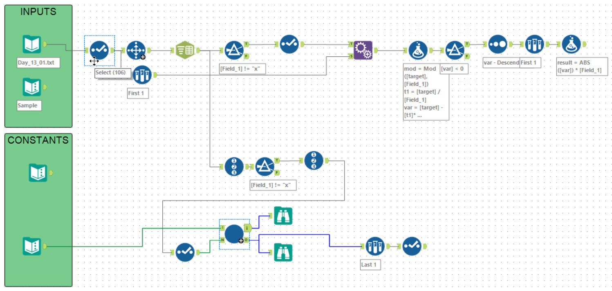
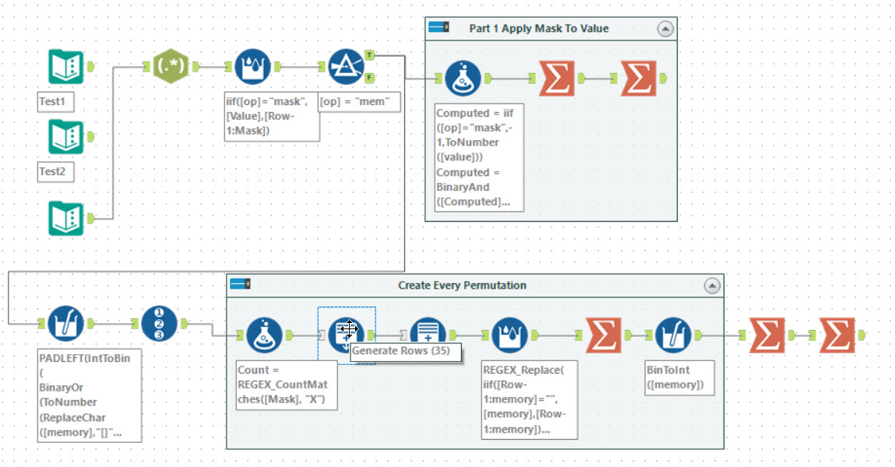
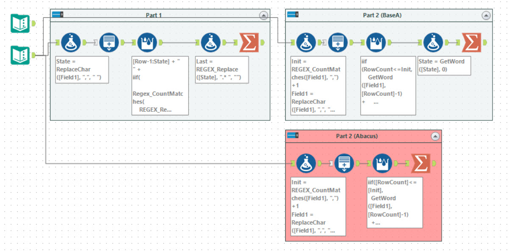
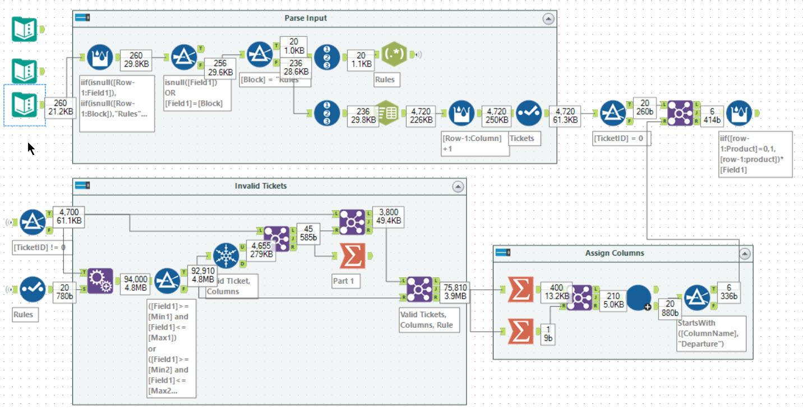
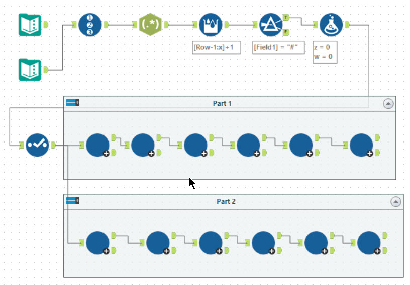
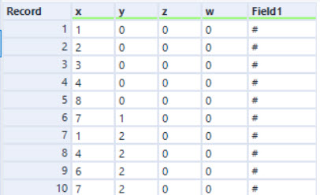
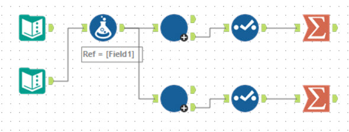
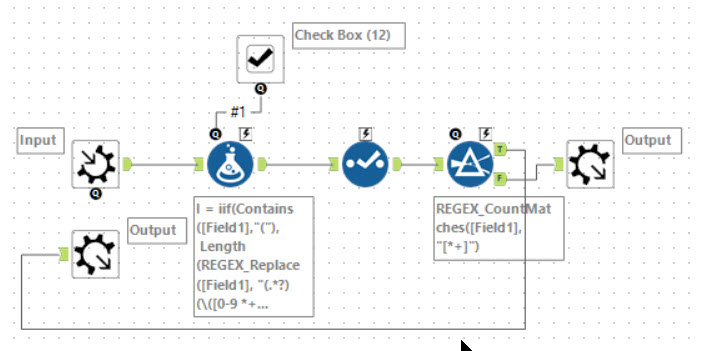
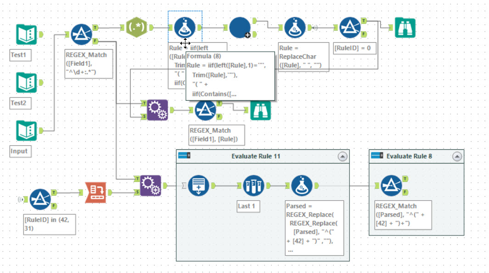
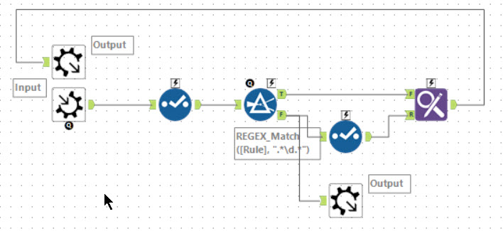

# Alteryxing The Advent of Code 2020 - Week 3


So [week 1](https://jdunkerley.co.uk/2020/12/05/alteryxing-the-advent-of-code-2020-week-1/) and [week 2](https://jdunkerley.co.uk/2020/12/13/alteryxing-the-advent-of-code-2020-week-2/) were both possible in BaseA Alteryx, although getting harder as the puzzles progress. Week 3 was the first time I needed to go beyond BaseA to find a solution for a couple of the parts (though in at least one case the community found a BaseA solution).

As with a couple of years ago, doing the Advent of Code, inspired me to do more work on the [Abacus](https://github.com/jdunkerley/AlteryxFormulaAddOns) library. This time I added four functions allowing for 64-bit integer-based arithmetic. The numbers need to be passed as strings and are returned as strings. The new functions are:

- `Int64Add(a,b,c...)` - sums all the inputs
- `Int64Mult(a,b,c...)` - products all the inputs
- `Int64Div(a,b)` - computes `a / b` using integer division (i.e. returns `Floor(a / b)`)
- `Int64Mod(a,b)` - computes `a % b` (i.e. returns the remainder of `a / b`)

Anyway, onto the puzzles!

## [Day 13 - Shuttle Search](https://adventofcode.com/2020/day/13)
- [Community Discussion](https://community.alteryx.com/t5/General-Discussions/Advent-of-Code-2020-BaseA-Style-Day-13/m-p/679903)


*Tools used: 21, run-time: 0.3s*

Part 1 was straight forward a simple formula of `CEIL([Time]/[ID])*[ID]-[Time]` gave the first time the bus would depart post the initial time. Part 2, however, was a lot harder and involved remembering (or [googling](https://www.google.com/search?q=solve+simultaneous+equations+modular)) some maths I had long since forgotten - the Chinese Remainder Theorem. Roughly, it breaks into the following steps:

1. Work out the *Product* of all the divisors (*n<sub>i</sub>*)
1. For each row work out *p<sub>i</sub>*, given by *Product / n<sub>i</sub>*
1. Solve the equation *s<sub>i</sub> p<sub>i</sub> = 1 (mod n<sub>i</sub>)*
1. A solution for the equations, *x* is given by the sum of all the *s<sub>i</sub>*
1. The minimal solution is given by *x mod Product*

I took a look at the python code from [Rosetta Code](https://rosettacode.org/wiki/Chinese_remainder_theorem) to help implement this in Alteryx. This solution worked perfectly for all the examples given in the puzzles. However, for the specific problem (a much larger set), the engine reported the following:


The problem is Alteryx formulas are always evaluated as doubles. This is only a problem in step 4, where the values get very high. One feature I didn't know is that the summarise tool will accurately sum fixed decimal types (thanks to Ned for this hint). This allows me to complete step 4 but still leaves me stuck on step 5. This is where I went to the Abacus library and implemented the needed 64-bit integer functions. Having done this a formula of `Int64Mod([Sum_v], [Product])` taking the values converted into strings, computes the correct answer to the puzzle.

### Other Workarounds in BaseA

[CGoodman3](https://community.alteryx.com/t5/General-Discussions/Advent-of-Code-2020-BaseA-Style-Day-13/m-p/679966/highlight/true#M3456) implemented an additional generate rows to try 300 values around the result produced by Alteryx and see if it solves the equations. [Ned Harding](https://github.com/NedHarding/Advent2020/blob/main/BigMult.yxmc) produced a macro which will handle big integer multiplication in BaseA. A useful tool if you need to deal with these huge numbers.

### Iterative Macro - Solving One Equation at a Time




[dsmdavid](https://community.alteryx.com/t5/user/viewprofilepage/user-id/18848)'s solution was a very elegant iterative macro solving each equation one at a time and then increasing the step size to solve the next one. To quote his [post](https://community.alteryx.com/t5/General-Discussions/Advent-of-Code-2020-BaseA-Style-Day-13/m-p/679969/highlight/true#M3457):

```
I began with pen and paper, then some excel:

I started with
- number 3, offset 0
- number 5, offset 1
- number 7, offset 2
- number 11,offset 3

3 & 5 --> the first number that qualifies is 9 (mod(9,3) = 0 && mod(9+1,5)=0).
Then I need to find a number that qualifies for (3,5) and 7. I start with the first number that qualifies for the previous condition, go in increments of (3*5) --will all keep qualifying for mod(z,3) = 0, mod(z+1,5) = 0 -- until I find one that qualifies mod(z+2,7) = 0 (the first number that qualifies is 54)

For the next, I'll start at 54 and increase in increments of 105 (3*5*7) until I find one that qualifies mod(z+3,11) =0. (789).

And so on.
```

A great solution - and BaseA without issue.

## [Day 14 - Docking Data](https://adventofcode.com/2020/day/14)
- [Community Discussion](https://community.alteryx.com/t5/General-Discussions/Advent-of-Code-2020-BaseA-Style-Day-14/m-p/680007)


*Tools used: 16, run-time: 4.6s*

Back into a comfortable puzzle for Alteryx. This problem involved some binary masking operations. For part 1, you needed to ignore the `X`s and to set the bits of the value to `0` when the mask was `0` and `1` when the mask was `1`. A couple of expressions easily achieved this:

```
BinaryOr([Computed], BinToInt(ReplaceChar([Mask], "X", "0")))  # Set the 1 mask bits
BinaryAnd([Computed],BinToInt(ReplaceChar([Mask], "X", "1")))  # Set the 0 mask bits
```

After this, its just a case of using a summarise tool to pick the final value (this could also have been done with a sample tool), and then a final summarise to total all the values.

For part 2, the meaning of the mask was changed. In this case, it is applied to the address rather than the value. Additionally, the `0`s are ignored. The `1`s are set on the address. The `X`s become wildcards meaning that treating both as `0` and `1` and both should be evaluated. 

For simplicity of diagnosing problems, I chose to use the `IntToBin` function to write the address as a 36 character binary string and applied the `1`s. Then using some generate rows, I created a row for every permutation and then using regular expressions created the new address values. Finally, after this, the same double summarise tools produced the answer.

## [Day 15 - Rambunctious Recitation](https://adventofcode.com/2020/day/15)
- [Community Discussion](https://community.alteryx.com/t5/General-Discussions/Advent-of-Code-2020-BaseA-Style-Day-15/td-p/680525)


*Tools used: 13, run-time: 3m49s*

This puzzle reminded me of [day 9 from 2018](https://adventofcode.com/2018/day/9). You need to hold a lot of state information and keep iterating. For part 1, at each step, you add a new number to the list. I chose to do this by keeping the current list as a string:


A generate rows tool is used to create 2020 rows, and then the state is generated using a multi-row formula with the expression:

```
[Row-1:State] + " " +
iif(
  Regex_CountMatches(
    REGEX_Replace([Row-1:State], "\d+$",""),
    "\b" + Regex_Replace([Row-1:State],".* ","") +"\b"
  ) == 0,
  "0",
  ToString(
    REGEX_CountMatches(
      REGEX_Replace(
        REGEX_Replace([Row-1:State], "\d+$",""),
        ".*\b" + Regex_Replace([Row-1:State],".* ","") + " ",
        " "
      ),
      " ")
  )
)
```

On each row, the current value is read from the last line of the string. If this value is present in the list (checked using the Regex_CountMatches) more than once, then we count the number of spaces between the last instance and the end of the string. If it wasn't present then a 0 is added.

For part 2, you need to do 30,000,000 iterations. This is clearly not possible with this string state I was keeping. It would involve a string with at least 60,000,000 characters. My first idea was to change to storing the state as key and value in the string, for example:


The expression to update this is fairly complicated (some horribly nested regular expressions). This approach was an improvement on my part 1 approach but took nearly 10 minutes to run 100,000 iterations. Doing a little bit of analysis, I estimated it would take at least 2 years to run this to 30,000,000 iterations.

My non-BaseA solution to this was to use the `VarNumExists` and `VarNum` feature of the Abacus library. These allow you to define a variable dynamically and then update it as needed. This makes the iterative formula:

```
iif([RowCount]<=[Init],
  GetWord([Field1], [RowCount]-1)
  + iif([RowCount]>1 AND VarNum([Row-1:Value], RowCount - 1),"",""),
  ToString(
    iif(VarNumExists([Row-1:Value]),
      RowCount-VarNum([Row-1:Value])-1,
      0)
    + VarNum([Row-1:Value], RowCount - 1) * 0
   )
)
```

The row value is just the current value, and the last time each row was accessed is stored in the `VarNum` variables. This allows Alteryx to complete the 30 million rows in about 4 minutes.

### Other Solutions

For part 1, a few went with the iterative macro approach to solving this. This was generally successful but significantly slower (4 minutes or so) versus the generate rows approach. That being said, [AkimasaKajitani](https://community.alteryx.com/t5/General-Discussions/Advent-of-Code-2020-BaseA-Style-Day-15/m-p/680864/highlight/true#M3486) found a huge performance boost by using the AMP engine.

I do not believe it is possible to do part 2 within BaseA rules in anything resembling a sensible time. Some resorted to the python tool to solve this which allowed for answers in a few seconds.

## [Day 16 - Ticket Translation](https://adventofcode.com/2020/day/16)
- [Community Discussion](https://community.alteryx.com/t5/General-Discussions/Advent-of-Code-2020-BaseA-Style-Day-16/m-p/681341)


*Tools used: 30, run-time: 0.7s*

The first task was to parse the input. This input contains a set of rules, each looking like `seat: 2-3 or 7-9`, and a set of tickets each being a comma-separated list. Using a Regex tool and Text to Columns, I ended up with:


Having parsed the input, the next task is to filter the tickets fields to see which rules are valid for which fields. I choose to use an append fields tool to add every possible rule to every ticket and column. You can then join this to the set of tickets to produce the tickets where no field passed any rule (the unique tool in my workflow is not needed - bad tool golf!).

For part 2, you need to work out which rule applies to which column. I chose to use an iterative macro to solve this. Firstly, I filtered out the invalid tickets (using a join tool). After this, I filter down to the valid Tickets, Columns and Rules. For each rule, I count the number of valid tickets and compare this with the distinct count of valid tickets. This gives the set of valid rules for each column:


The last step is the iterative macro:


In this case, each iteration picks out `ColumnName`s that only occur once in the list. The `Column` associated with this is then returned with the name, and all other rows with the same `Column` value are removed, and the iteration repeats. This is pretty similar to previous macros. Having solved this, the answer to the puzzle is easily obtained with a join and summarise.

Good to be back to pure BaseA!

### Macro Free


Most solutions for part 1 were pretty similar. So I chose to focus on [Danilang](https://community.alteryx.com/t5/user/viewprofilepage/user-id/34059)'s macro-free solution to build the column assignments. As with my macro approach, first, the results are filtered down to just the possible ones. Next, for each rule, a count of the possible matching columns is added (using the summary and join).

For each row, a concatenated string of all the possible column numbers is created and assigned to a value of the number of possible fields plus 1. By joining this to the ruleset, it is possible to work out which column has not been used and produce the required column mapping.

## [Day 17 - Conway Cubes](https://adventofcode.com/2020/day/17)
- [Community Discussion](https://community.alteryx.com/t5/General-Discussions/Advent-of-Code-2020-BaseA-Style-Day-17/m-p/681643)




*Tools used: 39, run-time: 23s*

The main issue I had with day 17 was understanding the example! I must have read it about 5 times before I cottoned on what was happening. As this only needed to be run 6 times and standard macros are a lot easier to debug than iterative macros I chose to copy the macro 6 times! My macro works for both parts 1 and 2 (i.e. it has been updated to work with 4 dimensions!).



Much like [day 11](https://jdunkerley.co.uk/2020/12/13/alteryxing-the-advent-of-code-2020-week-2/), the first task is to parse the input into the set of active cubes each with a `x`, `y`, `z` and `w` co-ordinate. This is then the input into the macro. The macro performs one iteration following the rules of the puzzle.

Within the macro, I chose to work out the minimum and maximums for each dimension and then created a 4-dimensional grid one larger in each dimension. For every cell, I also create the shift up and down by 1 in dimension (for part 1, I disable the `w` shifts). Having created this grid with the shift it is then a case of joining into the active cube set, and it becomes a straight forward summation and formula to compute the new set of active cells. The answer for the puzzle is just given by the number of rows in after the final macro.

My macro also produced a diagnostic output reproducing the string input in the puzzle. This allowed me to work out what was going on with the example and ensure I produced the same results.

## [Day 18 - Operation Order](https://adventofcode.com/2020/day/18)
- [Community Discussion](https://community.alteryx.com/t5/General-Discussions/Advent-of-Code-2020-BaseA-Style-Day-18/m-p/682294)




*Tools used: 8, run-time: 0.6s*

This puzzle involves implementing a custom order of execution. I chose to do this using an iterative macro evaluating one operation at a time. The macro was adapted to cope with addition being evaluated ahead of multiplication, so it solves both parts 1 and 2. The first question is whether the expression contains any brackets and if it does it zooms in onto that part:

```
I: iif(Contains([Field1],"("),
  Length(REGEX_Replace([Field1], "(.*?)(\([0-9 *+]+\)).*", "$1")),
  0)
```

This will look for the innermost paired brackets and counts the characters up to this point; otherwise, it leaves the index at 0. After this, it picks out the block to evaluate using:

```
ToEval: REGEX_Replace([Field1], ".{" + ToString(I) + "}(\([^)]+\)|[^(]+).*", "$1")
```

This will either be the entire expression of the inner most bracket. Within this bracket, it then either picks the first 2 values and the operator or if in addition first mode (denoted by `#1` being true), it hunts for the first `+`:

```
Ex: REGEX_Replace(Substring([ToEval],Index), "(\(?\d+ [[*+] \d+\)?).*","$1")
```

`Ex` includes leading and trailing brackets allowing for these to be preserved during the evaluation:

```
Eval: 
iif(right(Ex,1)!=")" and left(Ex,1)="(", "(", "") +
ToString(iif(Contains(Ex, "*"),
  ToNumber(GetWord(Trim(Ex,"()"),0)) * ToNumber(GetWord(Trim(Ex,"()"),2)),  
  ToNumber(GetWord(Trim(Ex,"()"),0)) + ToNumber(GetWord(Trim(Ex,"()"),2))))
+ iif(right(Ex,1)=")" and left(Ex,1)!="(",")","")
```

After this, it is just a case of substituting back into the outer expression. If the expression still has any operators in it, then the iteration runs again. To answer the puzzle, all is left to do is cast to an integer and sum the result.

## [Day 19 - Monster Messages](https://adventofcode.com/2020/day/19)
- [Community Discussion](https://community.alteryx.com/t5/General-Discussions/Advent-of-Code-2020-BaseA-Style-Day-19/m-p/682736)




*Tools used: 20, run-time: 0.5s*

Once more diving into regular expressions. This time the input defines an expression tree which can be built into a regular expression. This becomes yet another hierarchy walking iterative macro with it substituting the leaves into the parent building a very long (and hard to read!) regular expression. I use far too many brackets in my building up. So consider the input:

```
3: 4 5 | 5 4
4: "a"
5: "b"
```

The macro I build removes the " from 4 and 5 and adds a lot of brackets so that 3 gets evaluated to: `((ab)|(ba))`. Clearly, this could be simplified to `(ab|ba)`, but as it was working, I left it as it was. The full expression ends up with a lot of brackets! Having built the expression for 0, part 1 is given just by using a `REGEX_Match` filter.

Part 2 involved a little more thought. Having looked through the expression for 0, you can evaluate it by removing pairs of blocks - matching expression 42 at the start and expression 31 at the end. If you end up with something which matches repeated expression 42, then it is valid. I chose to do this with a generate rows tool removing the paired blocks, one pair for each generated rows. Then finally it looks to see if it matches repeat blocks of expression 42 using a filter tool.

All of the solutions posted to the community end up looking very similar, though with slightly different approaches to solving part 2. A shout out to [stephM](https://community.alteryx.com/t5/user/viewprofilepage/user-id/72436) for coming up with a solution which [doesn't involve an iterative macro](https://community.alteryx.com/t5/General-Discussions/Advent-of-Code-2020-BaseA-Style-Day-19/m-p/682808/highlight/true#M3539).

## Wrapping Up

So many iterative macros! However, I am really pleased to have passed my total stars from 2018 this week (33 stars in that year). I did have to solve 2 using Abacus functions, but still great to see how far we have got using Alteryx.


There are still a fair number of people trying to solve these each day, and over 40 people have solved one or more! A few more git repositories added this week:

- Mine: https://github.com/jdunkerley/adventofcode/
- NicoleJohnson: https://github.com/AlteryxNJ/AdventOfCode_2020
- ColoradoNed: https://github.com/NedHarding/Advent2020
- CGoodman3: https://github.com/ChrisDataBlog/AdventOfCode_2020
- AlteryxAd: https://gitlab.com/adriley/adventofcode2020-alteryx/
- NiklasEk: https://github.com/NiklasJEk/AdventOfCode_2020
- peter_gb: https://github.com/peter-gb/AdventofCode
- AkimasaKajitani: https://github.com/AkimasaKajitani/AdventOfCode
- dsmdavid: https://github.com/dsmdavid/AdventCode2020

Onto the final six days. Hopefully, someone can get the first 50 stars using Alteryx (with as much as possible in BaseA) this year - though as always it's a busy time of the year and the puzzles are getting harder!
