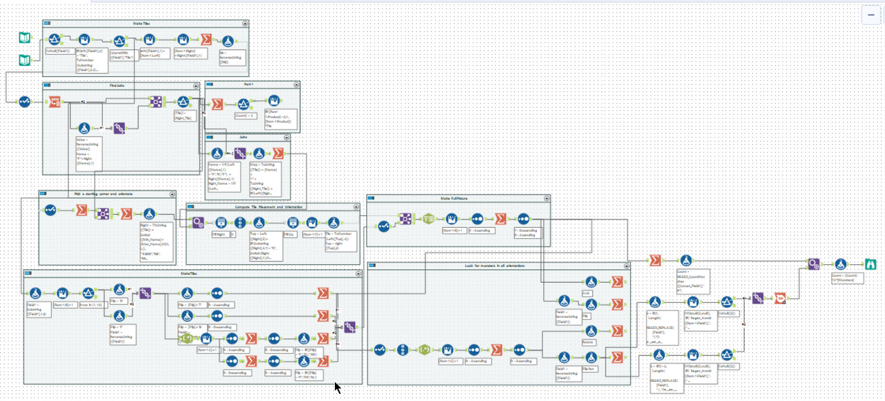
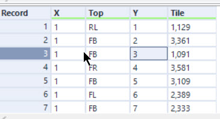
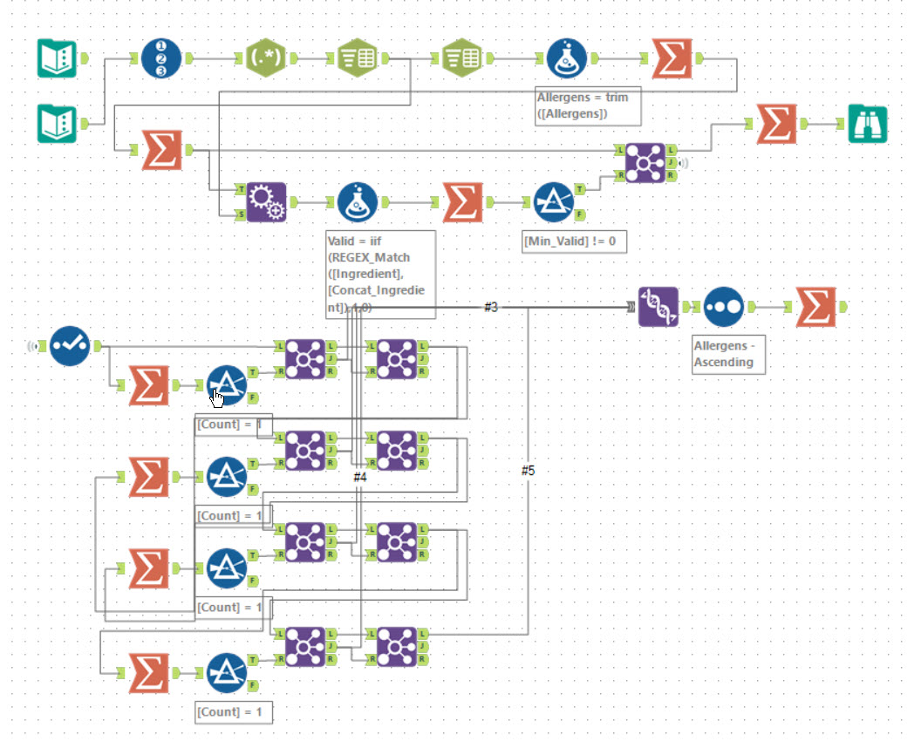
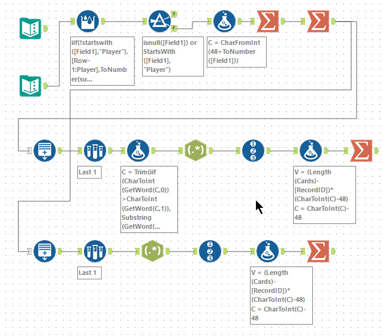
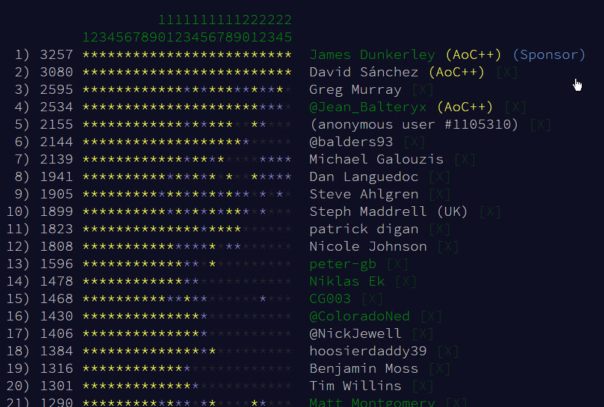

# Alteryxing The Advent of Code 2020 - Week 4


It's the end of the Advent of Code for 2020. The last week was tough - the part 1s were fairly easily doable but part 2s often were a lot harder. In the end I managed to solve all of this weeks but 1 in BaseA Alteryx. For the one I couldn't, I used BaseA Alteryx as much as possible and the Python tool for one step.

As Christmas approaches we all get busier so there are less of us still going strong. I will still pick the odd alternative solution where I found ones that are sufficiently different from my own and interesting. **A word of warning**, some of my approaches to solve within BaseA rules are complicated and not for the faint of heart!

Anyway onto the final 6 challenges.

## [Day 20 -Jurassic Jigsaw](https://adventofcode.com/2020/day/20)
- [Community Discussion](https://community.alteryx.com/t5/General-Discussions/Advent-of-Code-2020-BaseA-Style-Day-20/td-p/682893)


*Tools used: a lot - about 105, run-time: 0.8s*

This puzzle was all about putting a jigsaw together. The pieces were represented with by a 10 x 10 text block with either a `#` or a `.`.

```
..##.#..#.
##..#.....
#...##..#.
####.#...#
##.##.###.
##...#.###
.#.#.#..##
..#....#..
###...#.#.
..###..###
```

The first challenge was to find the four corners. Two pieces could fit together if the a side would line up with another side of a different tile with the `#` and `.` all aligned. The second tile could be rotated or reflected. I chose to read around the 4 sides clockwise producing 4 fields (`RT`, `RR`, `RB` and `RL`). I then reversed these four strings to produce the four edges reading anti-clockwise (`FT`, `FR`, `FB` and `FL`) - note `FL` is the reverse of `RR` and `FR` is the reverse of `RL` as the tile is flipped. Next, I looked for joins with the left side being one of the `R` fields and not joining to the same cell. Finding the corners was then a case of just finding tiles with 2 possible joins.

For part 2, the first problem was putting the picture together. I chose to first pick one of the corners. Using a summarise tool, I took the lowest value tile corner. I then wanted to orientate it so it is the bottom left tile. By looking at the two sides I had joins on I can work out which side is the right and top in terms of the original orientation:

|Side1|Side2|Top|Right|
|---|---|---|---|
|RB|RR|RR (Right)|RB (Bottom)|
|RR|RT|RT (Top)|RR (Right)|
|RL|RT|RL (Left)|RT (Top)|
|RB|RL|RB (Bottom)|RL (Left)|

I then produced a map of the joins as a single string. I did some pre-computation on this. If two tiles were both aligned the original way up then the `RR` on the first tile would join to a `FL` on the second tile, hence I need to flip `R` and `F`. The map was such that the second tile's entry would be the opposite to the join. In this example if tile 1234 was up the original way next to 4321 the entry would be `1234RR ==> 4321RR`. I encoded all of this into a long string that looked lie:

```
1907FB:2111FR 1907RB:2111RR 2017FL:3343FR 2017RL:3343RR 2477FR:3613FB 2477RR:3613RB 3671FR:2411RL ...
```

After this, using a generate rows tool, I walked right from the starting corner until I reached then end of a row - denoted by not being able to find another step in the map. This produced 12 rows of 1 tile. For each of these tiles, I knew the orientation as knew what the right side was, so could deduce the top side and if it was reflected or not. Having found the top of all 12, a second generate rows tool allowed me to complete the tile layout including orientation.



I won't go over all the remaining step in full detail as this post would be enormous but will summarise instead. First, for every tile, I produced 8 copies in each of the possible rotations and reflections. This could then be joined to the layout to produce the full picture I needed.

Within the full picture you needed to hunt for sea monsters. I chose to search using a regular expression for the middle line of the sea monster. Again the picture could be in one of 8 orientations however you only needed to check the four rotations to find out which rotation was correct. Having done that a multi-row formula allowed me to check if the previous and following rows matched for the found monster.

The second stage of this problem was fiddly to say the least, but fun thinking it through and though the workflow is massive actually quite a clean solution when complete.

## [Day 21 - Allergen Assessment](https://adventofcode.com/2020/day/21)
- [Community Discussion](https://community.alteryx.com/t5/General-Discussions/Advent-of-Code-2020-BaseA-Style-Day-21/m-p/683023)


*Tools used: 36, run-time: 3.3s*

In some ways this was similar to some of the other days. Well suited to Alteryx with just lots of parsing and joining. Breaking it first into a list of foods with their possible allergens. For a food to be possibly an allergen, it must be present in every list for that allergen. Using an append fields to create all possible joins of list of possible ingredient for each allergen it was then a case of removing any which were not always possible (using the `L` output of a join tool in my case).

For part 2, it was again the case of walking a hierarchy. This should probably have been an iterative macro but as I was tired of debugging these by this point I went for copy and paste each block. Each row allocated the allergens which had one possible food and then removed those foods from list and repeated again. In my dataset's case, it concluded in 4 steps (hence avoiding an iterative macro).

### More Sensible Solutions


I think my approach over complicated the first part somewhat. The much more sensible approach to solving part one was produced by [Danilang](https://community.alteryx.com/t5/user/viewprofilepage/user-id/34059). This involved just looking at the counts of allergens versus the ingredient/allergen count. It made the joins a lot cleaner to see what is going on (as opposed to making a dynamic regular expression as I did!).

Danilang also chose to use an iterative macro to fill all the possible rows. The iteration is as described above but involved less copy and pasting!

## [Day 22 - Crab Combat](https://adventofcode.com/2020/day/22)
- [Community Discussion](https://community.alteryx.com/t5/General-Discussions/Advent-of-Code-2020-BaseA-Style-Day-22/m-p/683661)


*Tools used: 21, run-time: 1hr 2mins*

This puzzle was basically a simplified version of Top Trumps. My two children would have been pleased. Part 1 was just an iteration and could be solved with an iterative macro - however the solution I present was built to allow me to solve part 2 (albeit very slowly!!!).

My input had a range of 1 to 50. I chose to encode these as characters so they would be 1 character each. To make debugging easier I chose it so that 1 mapped to character 1, 2 to 2, 3 to 3 up to 9 and then following with the next ASCII character (e.g. 10 to :). A formula of `CharFromInt(48+ToNumber([Field1]))` does this. I then joined the characters for each player into a string separated by a string. The example ends up as `92631 5847:`.  Then using a generate rows tool, I can iterate comparing the first letter of each word and moving round until only one word remains.

```
iif(CharToInt(GetWord(C,0))>CharToInt(GetWord(C,1)), // Player 1 wins
    Substring(GetWord(C,0),1) + Left(GetWord(C,0),1) + Left(GetWord(C,1),1) 
    + " " + 
    Substring(GetWord(C,1),1),
    Substring(GetWord(C,0),1) 
    + " " +
    Substring(GetWord(C,1),1)+ Left(GetWord(C,1),1) + Left(GetWord(C,0),1))
```

Because of my termination condition, I need to apply this again once more to finish it off (using a formula tool). Now onto part 2...

In this case we need to keep a record of where we have been and also deal with recursion! Alteryx is not designed to implement a recursive algorithm. This would clearly be pretty straight forward in a general purpose programming language. Lets deal with the record of past moves first and then think about recursion.

```
    // Play a turn
    iif(CharToInt(GetWord(C,0))>CharToInt(GetWord(C,1)),
        Substring(GetWord(C,0),1) + Left(GetWord(C,0),1) + Left(GetWord(C,1),1) + " " +Substring(GetWord(C,1),1),
        Substring(GetWord(C,0),1) + " " +Substring(GetWord(C,1),1)+ Left(GetWord(C,1),1) + Left(GetWord(C,0),1))

    // Add New Played
    + " " + GetWord(C,0) + "#" + GetWord(C,1) 

    // Keep Old
    + Regex_Replace(C,"^[^ ]+ [^ ]+ ?", " ")
```

This handles playing the turn and adding a new word representing the current state as `<Player1>#<Player2>` (`#` is safe to use as it's ASCII code is less than 47). You can then look for this string in existing string to see if you have already played this.

```
ELSEIF Contains(REGEX_Replace(C, " ! .*$", ""),GetWord(C,0) + "#" + GetWord(C,1)) THEN
    // Player 1 win by termination
```

This gives a sequence like:

```
92631 5847:
263195 847: 92631#5847:
63195 47:82 263195#847: 92631#5847:
319564 7:82 63195#47:82 263195#847: 92631#5847:
19564 :8273 319564#7:82 63195#47:82 263195#847: 92631#5847:
```

The next problem is how to deal with a recursive step being needed. The start of a subgame can be easily detected by looking at the lengtb of the first word versus it's ASCII code:

```
ELSEIF CharToInt(GetWord(C,0)) - 48 < Length(GetWord(C,0)) and CharToInt(GetWord(C,1))-48 < Length(GetWord(C,1)) THEN
    // Do I need to recurse
    Substring(GetWord(C,0),1,CharToInt(GetWord(C,0)) - 48) + " " + Substring(GetWord(C,1),1,CharToInt(GetWord(C,1))-48) + " ! "+ C
```

That happens here is that 2 new words representing the starting positions of the sub-game are added followed by a `!` to represent the end of the sub-game. This sub-game can then be played until a winner is found.

The final piece of the complicated formula is working out how to resolve a game or sub-game when a player wins. In this case, either it ends with a single word (as per part 1) or adjusting the parent game's state. The expression below represents player 1 winning:

```
    iif(Contains(C," ! "),
        Substring(GetWord(REGEX_Replace(C, "^[^!]+ ! ", ""), 0), 1)
        + Left(GetWord(REGEX_Replace(C, "^[^!]+ ! ", ""), 0), 1)
        + Left(GetWord(REGEX_Replace(C, "^[^!]+ ! ", ""), 1), 1)
        + " " + Substring(GetWord(REGEX_Replace(C, "^[^!]+ ! ", ""), 1), 1)
        + " " + GetWord(REGEX_Replace(C, "^[^!]+ ! ", ""), 0) + "#" + GetWord(REGEX_Replace(C, "^[^!]+ ! ", ""), 1)
        + Regex_Replace(C, "^[^!]+ ! [^ ]+ [^ ]+ ?", " "),
        Substring(GetWord(C,0),1) + Left(GetWord(C,0),1) + Left(GetWord(C,1),1))
```

Putting it altogether gives a very long expression but one which will run the whole recursive game in an iterative way! I added a small additional step which meant an extra formula tool wasn't needed. The long strings and hence slow manipulation makes this a long process to complete but it does work in BaseA!

## [Day 23 - Crab Cups](https://adventofcode.com/2020/day/23)


## Day 24

## Day 25

## Wrapping Up

There we have it. Advent of Code 2020 done. The table below shows my successes (* - BaseA, A - Abacus, P - Python tool):

|Day   |1|2|3|4|5|6|7|8|9|10|11|12|13|14|15|16|17|18|19|20|21|22|23|24|25|
|------|-|-|-|-|-|-|-|-|-| -| -| -| -| -| -| -| -| -| -| -| -| -| -| -| -|
|Part 1|*|*|*|*|*|*|*|*|*| *| *| *| *| *| *| *| *| *| *| *| *| *| *| *| *|
|Part 2|*|*|*|*|*|*|*|*|*| *| *| *| **A**| *| **A**| *| *| *| *| *| *| *| **P**| *| *|

We had a few people make it to the end. I can't comment if anyone found BaseA solutions to 15 part 2 and 23 part 2 but I believe not, some did find a workaround or pure solution using BaseA for 13 part 2. Either way 50 stars feels a great accomplishment with 47 in BaseA and all within Alteryx. 



The list of repositories I know of is below (no new ones added this week):

- Mine: https://github.com/jdunkerley/adventofcode/
- NicoleJohnson: https://github.com/AlteryxNJ/AdventOfCode_2020
- ColoradoNed: https://github.com/NedHarding/Advent2020
- CGoodman3: https://github.com/ChrisDataBlog/AdventOfCode_2020
- AlteryxAd: https://gitlab.com/adriley/adventofcode2020-alteryx/
- NiklasEk: https://github.com/NiklasJEk/AdventOfCode_2020
- peter_gb: https://github.com/peter-gb/AdventofCode
- AkimasaKajitani: https://github.com/AkimasaKajitani/AdventOfCode
- dsmdavid: https://github.com/dsmdavid/AdventCode2020

That's a wrap for 2020 - it's been a lot of fun. I look forward to 2021 and the next set of challenges. A great thanks to [Eric Wastl](http://was.tl/) for setting the amazing puzzles.
