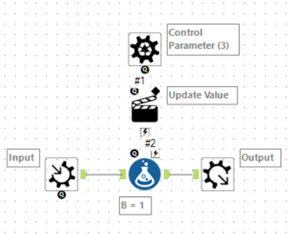
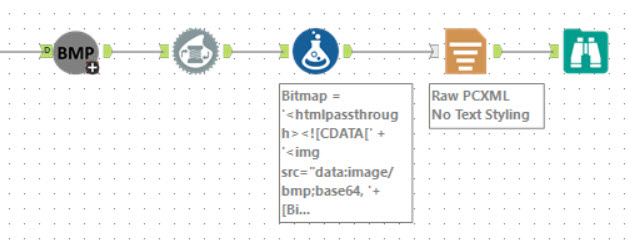
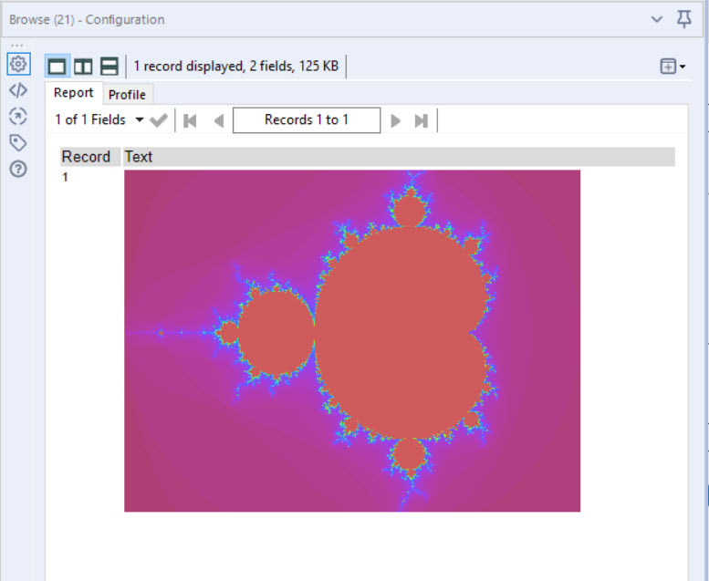

# Creating a Mandelbrot Set in Alteryx


When I was young and starting to program, one of the things that fascinated me was generating images with fractals. Given an often simple algorithm, you can create incredible images with very little code. The Mandelbrot set is a one such. As an experiment, and to test out the AMP engine, I wanted to experiment with creating one in Alteryx. As usual [BaseA](https://jdunkerley.co.uk/2019/11/29/lets-alteryx-the-advent-of-code-2019/) rules apply!

I thought it would also be interesting for people to see some of the iterations I went through rather than just the end product. This first post is only going to concentrate on the computation of the data for the set, the way I chose to produce the image, rendering as bitmap file, is one for another day.

## Quick Overview of How to Calculate the Mandelbrot Set

The Mandelbrot set starts with a simple equation that:


With *z<sub>0</sub>=0* and *c* being a [complex number](https://en.wikipedia.org/wiki/Complex_number). This means that *z<sub>1</sub>=c*. 

Expanding this into real and imaginary parts:

Let  where *i* is the square root of -1


To produce the picture of the Mandelbrot set, you scan through different values of *c* and see if the iterative equations tends to infinity or remains bounded. This is normally tested by if the absolute value of *z* exceeds 2 within a certain number of iterations. The absolute of *z<sub>n</sub>* is:


In order to speed up the computation slightly, I chose to check when the absolute of z squared exceeded 4.

The colour of the point at *c* can be produced by how fast the iteration exceeded the limit. I chose to use a colour scheme from [D3](https://observablehq.com/@d3/color-schemes) - specifically the Rainbow one.

## Computing the Iterative Equation in Alteryx

So there a few options of how to create the set within Alteryx. Lets start with the simple part - creating the grid of points we will evaluate across. 


The input I chose for this was:

|Dim|Min|Max|Points|
|---|---|---|---|
|Real|-2|1|800|
|Imaginary|-1.1|1|600|

Using a formula tool, can compute the step size (`([Max]-[Min]) / (Points - 1)`). Feeding this into a generate row tools to make the 800 real points and 600 imaginary points. After this, using a Append Fields tool set to allow all appends it creates the complete grid of points.


The complication for the iterative equation is that we need to iterate 2 variables and track the numbers of steps. I tried a few different approaches to this.

### Approach 1: Iterative Macro

Probably the most obvious is to use an iterative macro. These can be sluggish but as each iteration will act on the entire grid and a maximum of about 80 steps will be needed its not a bad approach. First lets add a couple of columns to the grid:


1. *Thres*: The threshold to declare it is tending to infintiy
1. *MaxSteps*: Number of steps to test the data on
1. *ri*: Current real value
1. *ii*: Current imaginary value


Each iteration of the macro does the following:

1. Compute *di* the current value of the *|z|*
2. Compute the new values for *ri* and *ii*
3. Split the data set looking at those points which have *di > thres* or if maximum iterations has been reached.
4. Return those rows to the outer workflow, loop the others with the updated *ri* and *ii* values.

This approach was pretty straight forward and produces a 1080p image in about 45 seconds on my laptop. In this approach the difference between AMP engine came out slightly slower than the old E1 engine - 52.3 seconds vs 41.1 seconds.

### Approach 2: String States

One approach to iterate a value in Alteryx is to use the [Generate Rows](https://help.alteryx.com/current/designer/generate-rows-tool) tool. This is pretty straight forward to iterate a single value, for example to create 100 rows you can count from 1 to 100. In this case, we need to iterate 3 values - iteration number, real and imaginary values. One simple trick to do this is to keep it as a string:

```text
<Count> <Real> <Imaginary>
```

ALteryx provides a very useful function `GetWord` which allows you extract a single word from the text. Combining this with the `ToNumber` and `ToString` functions you can construct the iteration:


The Generate Rows tool is set to create a new `V_String(48)` field. It is initially set to `1 0 0`. The step is given by:

```text
ToString(ToNumber(GetWord([State], 0)) + 1) + " "
+ 
ToString(
Pow(ToNumber(GetWord([State], 1)),2) - Pow(ToNumber(GetWord([State], 2)),2) + [r0]
) + " "
+ 
ToString(2 * ToNumber(GetWord([State], 1)) * ToNumber(GetWord([State], 2)) + [i0])
```

The expression breaks into three parts:

- `ToString(ToNumber(GetWord([State], 0)) + 1)` increments the first value by 1.
- `ToString(
Pow(ToNumber(GetWord([State], 1)),2) - Pow(ToNumber(GetWord([State], 2)),2) + [r0]
)` implements the Real part calculation
= `ToString(2 * ToNumber(GetWord([State], 1)) * ToNumber(GetWord([State], 2)) + [i0])` implements the Imaginary part.

The `ToNumber(GetWord([State], 1))` allows you to extract one of the values from the string and convert it back to a number. 

The final part of the Generate Rows is the termination condition:

```text
ToNumber(GetWord([State], 0)) <= [MaxSteps]
AND
Pow(ToNumber(GetWord([State], 1)),2) + Pow(ToNumber(GetWord([State], 2)),2) < [Thres]
```

In this case, the first line checks number of steps executed. The second evaluates if the iteration has broken out.

After this a Sample tool is used pick the final row of each iteration and then a formula tool extracts the initial number.

Producing a 1080p image with this workflow is substantially slower than the iterative macro approach. Using E1 it took about 8 minutes. AMP gave it a nice performance boot up to about 5 minutes 30 seconds. But with either engine a chunck slower.

### Approach 3: Spatial Objects

My next approach was to use spatial objects and formulas in the Generate Rows tool. This approach was to use the Latitude and Longitude of points as Real and Imaginary values. Each step would add a new point to the current spatial object and then assess when to terminate based on its distance from 0,0 and now many points there are.

This was a failed experiment as it was way slower than either of the above approaches so I didn't complete it. I tried generating rows and using multi-row formulas but again to no significant success.

The one call out from this is the [Spatial Functions](https://help.alteryx.com/current/designer/spatial-functions). They are often overlooked but provide a lot of power in formula tools.

### Approach 4: Dynamic Formula

My last approach was to use a dynamic formula to build the iteration in a single formula tool. Starting by defining `ri` and `ii` as the current real and imaginary values and initialising them to 0. Additionally, define `i` to be the step of the iteration. The one catch is I need to know when the iteration terminates - I chose to indicate this by switching i to be a negative value. The following three expression evaluate one step of the iteration in a formula tool:

```text
i: iif([i]<0,[i],iif([i]>=[MaxSteps] OR [ri]*[ri]+[ii]*[ii]>[Thres],-[i],[i]+1))
t: iif([i]<0,0,[ri]*[ii])
ri: iif([i]<0,[ri],[ri]*[ri]-[ii]*[ii]+[r0])
ii: iif([i]<0,[ii],2*[t]+[i0])
```

Note, *t* is needed as `ri` is mutated prior to computing `ii`.

The next step is to extract the XML for these :
```xml
    <FormulaField expression="iif([i]&lt;0,[i],iif([i]&gt;=[MaxSteps] OR [ri]*[ri]+[ii]*[ii]&gt;[Thres],-[i],[i]+1))" field="i" />
    <FormulaField expression="iif([i]&lt;0,0,[ri]*[ii])" field="t" size="8" type="Double" />
    <FormulaField expression="iif([i]&lt;0,[ri],[ri]*[ri]-[ii]*[ii]+[r0])" field="ri" />
    <FormulaField expression="iif([i]&lt;0,[ii],2*[t]+[i0])" field="ii" />
```


The XML can be found by going to the XML tab in the properties pane for the Formula tool. Using a formula tool to create a copy of this XML, and then a Generate Rows tool to repeat it the maximum steps times. This can then be fed into summarise tool in concatenate mode to build a big block of XML.

For initial testing, manual edit the XML to be this long new expression between the `FormulaFields` tags. If all is working, using a simple batch macro to update a formula tool allows this to be more automated:



The control panel is fed into the formula tool and using an Action tool to update the inner XML between the `FormulaFields`. The very last thing to remember is `i` will be the negative value at the end so and additional formula tool is needed to switch signs.


Using my same test of producing a 1080p image, the difference between AMP and e1 was minor (1:06 vs 1:10). I also tested without the batch macro and this made next to no difference.

## Assigning Colours and Rendering the Output

The next step for producing the image is to convert the number of steps taken into a colour.


Starting with a list colours from the D3 page expressed as hexadecimal strings, add a RecordID. Then using a MOD function you can filter out so only the right number kept. Adding a new RecordID which can then be used with a Find and Replace to join to the computed set. Using Find and Replace avoids the larger data set being resorted but does mean that the record ID needs to be cast as a string using a Select tool.



I'm not covering the rendering of a bitmap in this post (hopefully will detail that in a later post) but using a little trickery with blobs and base64 encoding it is possible to render it in a reporting tool. The final output looks like:



## Wrapping Up

Hopefully this post gives you some insight from the different ways I tried to produce the image. The workflows for this post available below:

- [Iterative](https://www.dropbox.com/s/do1stzy4qykl2ng/Mandelbrot%20Iterate.yxzp?dl=0)
- [Strings](https://www.dropbox.com/s/z11iih5h9dzo9ig/Mandelbrot%20String.yxzp?dl=0)
- [Dynamic Formula](https://www.dropbox.com/s/qrdx80lozmf8rbo/Mandelbrot%20Formula.yxzp?dl=0)
