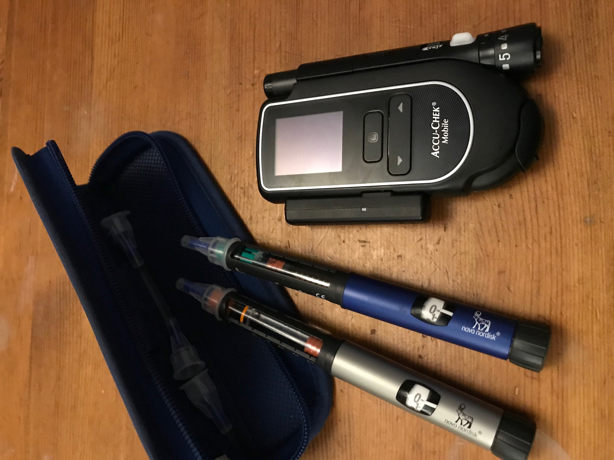
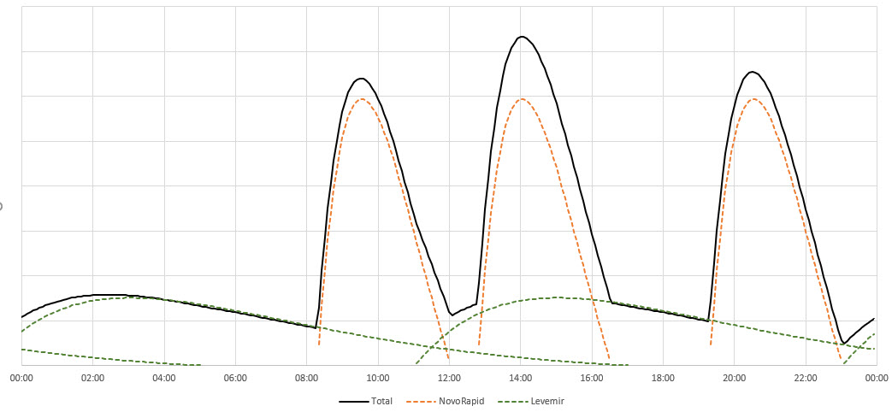

# Diabetes Log (Part 2) - Being a Diabetic, and data data data ...

So forever ago (well back in January), I wrote a post on creating a [.Net Core lambda](https://jdunkerley.co.uk/2019/01/08/creating-a-simple-aws-lambda-in-c/). The goal I want to produce is a tool to record and help me track everything I need for looking after me. This post is going to be a personal one telling you about my life with the condition.

## What Does Being a Diabetic Entail...

So this is my regime. Everybody who has Diabetes will have their own way of doing what they need - I am far from an expert but this is how I deal with it. I was diagnosed as a diabetic back in November 2004. I am a Type 1, hence this is what I know about. While there are similarities with Type 2, I wont talk about that as have no personal knowledge. My main knowledge comes from years of experience and the fantastic [DAFNE](http://www.dafne.uk.com/) course.

Diabetes mellitus type 1 is an auto immune disease where the immune system attacks the beta producing cells in the pancreas. This means that the body can only produce little or no insulin. Without insulin, the body cannot regulate the level of sugar in the blood. Incorrect sugar levels can lead to a whole range of compications both in the short term and longer term. In order to control this, you need to inject insuling into the body in some way.

The causes of Type 1 are complicated. It is not a simple genetic condition (though the presence of a family member with it increses the risk). It is not caused by exercise or diet but some environmental factors do play into it. In my case, I had an operation and nasty infection and that was the trigger event. 

Insulin control is far from trivial. If you have too little sugar in your blood, then you can have an incident of hypoglycemia (a hypo). This can lead to confusion and clumsiness, and in extreme cases loss of consciousness or even death. At the opposite end of the spectrum, if you have high levels of sugar in your blood, then you can cause significant organ damage over time. In extreme cases you can develop Ketoacidosis which can again end in a coma and time in hospital. So careful management is key.

The way to monitor this is to check you blood sugar levels. The best measure of this is a full blood test called an HbA1C. This measures the level of the sugar in the blood over the last 2 to 3 months. I get this done about twice a year when I see a nurse or consultant. The goal is to have this less than 7%. For day to day monitoring you can check the instant level of sugar in your blood using glucose monitor. I use [AccuCheck Mobile](https://www.accu-chek.co.uk/blood-glucose-meters/mobile) - prick my finger and it gives me a reading of the instant level. For the instant measurement the goal is to be in the range of *4 - 8 mmol/l*. If you averaged *7 mmol/l* you would get an HbA1C of about 7%. Readings of less than *4 mmol/l* would indicate a hypo, higher that *8* would indicate too much sugar.

There are so many factors which affect the blood sugar level, it is crazy - some are obvious, some less so. Let's start with insulin. I have two types of insulin that I need to take - Levermir and Novo Rapid. [Levermir](https://en.wikipedia.org/wiki/Insulin_detemir) is a long-acting insulin (Basal) designed to provide a background level in the blood to keep the body able to process some sugar. It takes a while to start acting and then lasts for about 18 hours so I need to take this twice a day. [Novo Rapid](https://en.wikipedia.org/wiki/Insulin_aspart) is a fast-acting insulin (Bolus) taken in responce to food. It starts acting within about 15 minutes and lasts around 3 hours. The real complication is working out how much insulin to take. This takes us on to the next factor food! The chart below shows a qualitative view of the insulin level in my body over a 24 hour period.

Food is the source of all the carbohydrates in our bodies. Often in diabetes we talk about sugar but it is actually more generally carbohydrates that matter. The amount of the bolus insulin you need is directly related (approximately linearly) to amount of carbohydrate you eat. This leads onto the concept of 'carb counting'. When you each food you can break down into the different food types and work out (approximately) how much carbohydrate there is and you have consumed. The nutritional information on packs will have this. Having got this number you can then convert into a number of units insulin need. In my case 10g of carbohydrate equates to about 1.5 units of NovoRapid. The ratios will vary from person to person and even meal to meal (as they do for me). It is so easy to get this wrong. Couple of extra units of insulin and you will have a hype, couple of units short and you will be sky high. Like everything with this disease, you get better with practice and continual work.

So thats the principal factors. The next area is exercise. If you do additional exercise the level of insulin you need goes down. First causing a reduction in the quick acting insulin to avoid a hypo. Doing exercise regularly will improve your metabolism and probably increase the sensitivity of your body to insulin so will further reduce the basal dose you need. Likewise you can lose weight doing exercise.

Weight is yet another factor into how much insulin you need. The more you weigh, the more insulin you need in general. Unfortunately this comes with a nasty positive feedback loop. The more insulin you take, the more hungry you feel, the more weight you will put on and then hence the more insulin you will need. This leads to a very difficult cycle to break.

There are many more factors which affect the level of sugar, but this gives you a feel of them. All of this adds a pretty heavy burden onto the day to day life of a diabetic. The potential complications caused by the disease also need checked for. My annual review includes a check of many internal organs functions (e.g. kidneys) and I need to keep a watch on my blood pressue as high blood pressure can compound issues with diabetes.

## Technology and the Future

Diabetes care is getting better and better. The insulins are much more advanced than they once were. They allow me to lead a normal live - I can eat what I want and do anything I wish. Sure there is a constant workload to manage the condition but the modern drugs allow you to balance things around your life.

The glucose meter I use today is significantly more advanced than the old one I got when I was first diagnosed. It links to my phone over bluetooth and allows me to transfer reading instantly. While I dont have one, continuous glucose monitors are becoming more common. They allow for real time checking and monitoring of sugar levels. 

The [NovoPen 5](https://www.novonordisk.com/patients/diabetes-care/pens--needles-and-injection-support/NovoPen5.html), which I use to inject insulin, has gained a memory function which tells you when you last injected. The next version is on the horizon and this has NFR communication and keeps a record of a whole set of injections. This will minimise risk of missing or extra injections. While I don't have one, insulin pumps have also increased in use and these again are developing quickly.

The holy grail for diabetes is the closed loop. If you can take the readings from a glucose monitor and inject the correct amount of insulin you can vastly reduce the burden a diabetic lives with. The [Open APS](https://openaps.org/) project is a truly incredible project started by [Dana Lewis](http://twitter.com/danamlewis) and [Scott Leibrand](http://twitter.com/scottleibrand) to build an artificial pancreas system using existing medical devices with an open source design and implementation. The work they do certainly gives hope to me and I am sure many other diabetics.

## So What Do I Want To Build

Hopefully this has given you a flavour of living with the disease. I end up every day:

- Testing my blood about 5 times a day (my fingers are perferated)
- Injecting two different insulins a total of 5 times
- Computing dose leves and carb counting food for every meal
- Doing exercise to reduce insulin levels and improve controls
- Monitoring of blood pressure and weight. 

This adds up to a ton of data being produce by a disparate set of devices and while they all have little apps and tools I want it all in one place. Since I was taught the DAFNE course, I came up with my own spreadsheet based record tool. It records:

- Weight and BMI
- Insulin injections, what I ate, blood glucose levels
- Estimates a daily, weekly HbA1C from average readings
- Blood pressure readings
- Basic charts to show some quick details

I find it to be helpful to my control and want to turn it from a rough and ready Excel prototype to a more reliable cloud based solution that others could potentially use as well. In the next post will start thinking about the data store and building it out.