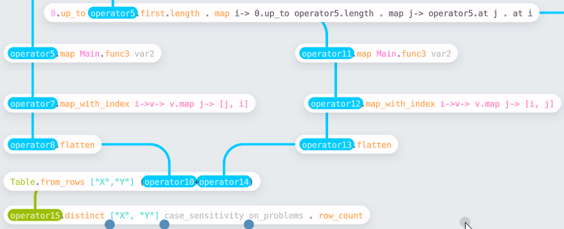
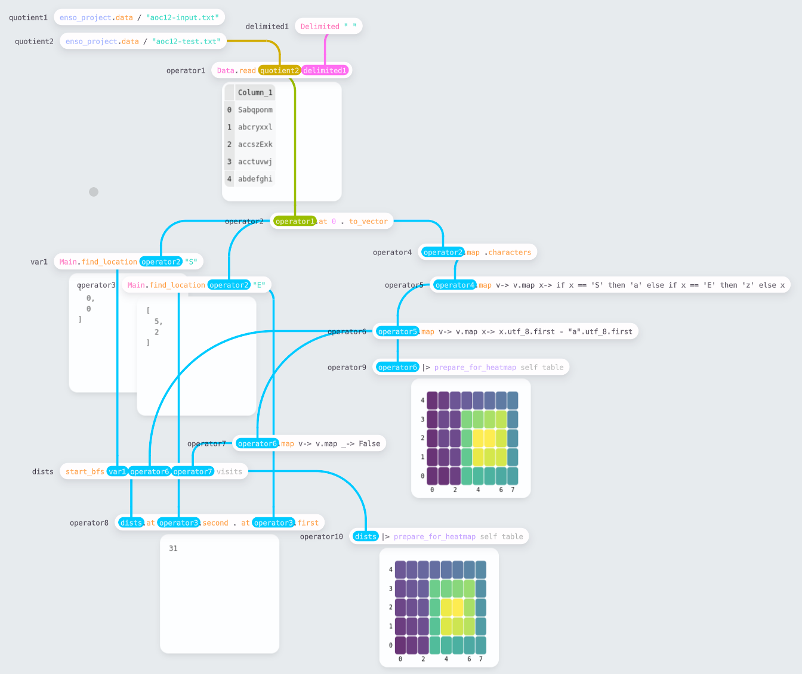
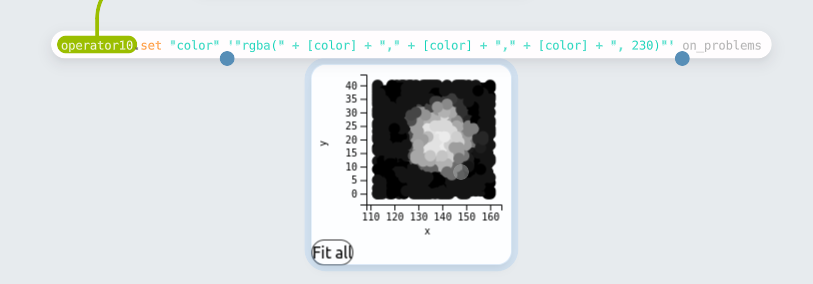

# Solving Advent of Code 2022 with Enso


Some members of the team building [Enso](https://enso.org/) decided to try and tackle last year's [Advent of Code](https://adventofcode.com/2022/) using the language and see how far we could get. I've previously tried [solving Advent of Code in Alteryx](https://jdunkerley.co.uk/2020/12/05/alteryxing-the-advent-of-code-2020-week-1/) and was personally interested to know whether it is easier or more challenging with what we are building.

For those not familiar with the Advent of Code, every year [Eric Wastl](https://twitter.com/ericwastl) creates a set of 25 programming puzzles posted once a day over December. Each puzzle has two related parts with an example set of values and the expected result based on these. Often, the second part is a more challenging extension of the first part. Generally, there should be a solution that can complete within a few seconds (although we didn't always find that one!).

This post summarises a few of the puzzles we tried and some of the challenges we faced, giving the views and experience of myself, [Jaroslav Tulach](http://apidesign.org), and [Radosław Waśko](https://radeusgd.com/) of us trying to solve them.

## Jaroslav's Experience with Day 1 - Calorie Counting

- https://adventofcode.com/2022/day/1

Initial tasks of Advent of Code are usually quite simple. That is great, especially when starting with a new language or an IDE. As such, let's look at the _Calorie Counting_ task and how it can be solved with Enso and its IDE. I'll do my best to share what I learned while going through the puzzle. I was not new to the Enso language - e. g. it wasn't a problem to express the algorithm. However, I usually coded Enso in a text editor. This time I wanted to taste the real Enso IDE experience.

Problem #1 - how do I read a file? When you create a project, you get an `src` directory. However, you can also make a `data` directory sibling and put the associated data files there. You can then reference that directory as `enso_project.data` in your code. Reading a text file is then simple as

```haskell
enso_project.data/"aoc1-test.txt" . read
```

Problem #2 - working with the textual file requires you to split the text into lines. Great, there is `.lines` function. But then there are groups of lines waiting to be processed. My original solution was just `.fold` over the lines and pass in a `Pair` of two numbers. However, there is a much nicer solution: `operator1.split '\n\n'` - split the text on two new lines! Then one gets the needed groups easily.

Problem #3 - converting the text lines to numbers. It is as simple as `_.map Integer.parse` - however, I learned a handy trick. You can collapse a graph of nodes into a new function. You can then use it in multiple places. Not just that, when double-clicking on the function name, you tell the Enso IDE to open up the collapsed part, and you can refine it and test it with input values. That's cool as it allows one to keep the program clean, focused on individual tasks, and nicely organized inside a single project.

Problem #4 - is to do some statistics on the obtained data. If you are like me, you just do some arithmetic, but the cool kids (those who know all the Enso libraries) use `Statistic` library functions. Then it is just about requesting `Statistic.Maximum`, or `Statistic.Sum`. Nice, powerful, and easy to obtain the desired results.

The 'Calorie Counting' was a simple task, but it opened the door for me to the Enso IDE, its concepts, and the power of the libraries it offers. I  recommend trying this simple task yourself. It is fun, and it is worth it!

## My Experience with  Day 8 - Treetop Tree House

- https://adventofcode.com/2022/day/8

So by day 8, we were more into the swing of it, and the internal competition had heated up. The timezone disadvantage of living in the UK was showing, and those early risers were getting solutions published before I was even awake! The first week of puzzles led to various library improvements and stability fixes that made working in the IDE more pleasant and quicker.

Again the first challenge is loading the data and shaping it into something we can work with:


I chose to fetch the data directly from the website using `Data.fetch`. This API reads the URL, and if in a format Enso recognizes will automatically parse it. In this case, the data is just text. In this case, I wanted to parse the text into a 2D vector of integers, which is easily accomplished by breaking into lines (using `.lines`) and then parsing each character (the `.map s-> s.characters.map Integer.parse`).

The next task is to find how many trees are visible outside the grid. Taking just the horizontal scan, I build a small function (using the approach Jaroslav describes above by grouping nodes):


The function works by computing the maximum height from both ends of the vector to the current point and seeing if the current is higher. It then gathers the indices of visible trees. The view shown is the expanded function showing how you can trace the computation through. `var2` is the input to the method, and it is easy to change the values and test the process from the parent workflow.



Having built the row process (called `Main.func3` in the workflow), this can then be run on columns by transposing the input dataset. Finally, having gathered the complete set of coordinates, we need to make a unique set to find the count. I chose to do this by converting to a table (using `Table.from_rows`) and then using the `.distinct` function.

Part 2 was a straightforward adjustment to the process, looking out from a tree rather than looking in.

*Since building this workflow, we have added the ability to compute running statistics which would have made these computations easier. Likewise, the issue we had at the time with `Vector.distinct` has been resolved, so the need to convert to a table is removed.*

## Radosław's Experience with Day 12 - Hill Climbing Algorithm

- https://adventofcode.com/2022/day/12

In this part I was given a heightmap of a terrain and I had to find a shortest route to a particular endpoint that can be climbed by going up at most 1 unit on each step.

This was obviously a task for a BFS algorithm and starting to write it, I decided it may be easier to write the main loop itself in text mode.

So I did just that:

<style type="text/css">
<!--
body {color: #000000; background-color: #ffffff; font-family: monospace}
pre {color: #000000; background-color: #ffffff; font-family: monospace}
table {color: #000000; background-color: #e9e8e2; font-family: monospace}
.ST1 {font-family: monospace; font-weight: bold}
.ST0 {color: #969696}
.ST3 {color: #1e9347}
.ST2 {color: #336bdd}
-->
</style>
<pre>
<span class="ST0">##</span><span class="ST0"> A helper that updates a 2d array,</span>
<span class="ST0">   setting the entry at coordinates [vx, vy] to the value `val`.</span>
<span class="ST1">set</span> <span class="ST1">visits</span> <span class="ST1">vx</span> <span class="ST1">vy</span> <span class="ST1">val</span>  =
    operator8 = <span class="ST1">visits</span>.<span class="ST1">map_with_index</span> <span class="ST1">y</span>-&gt; <span class="ST1">v</span>-&gt; <span class="ST2">if</span> <span class="ST1">y</span> == <span class="ST1">vy</span> <span class="ST2">then</span> (<span class="ST1">v</span>.<span class="ST1">map_with_index</span> <span class="ST1">x</span>-&gt; <span class="ST1">e</span>-&gt; <span class="ST2">if</span> <span class="ST1">x</span> == <span class="ST1">vx</span> <span class="ST2">then</span> <span class="ST1">val</span> <span class="ST2">else</span> <span class="ST1">e</span>) <span class="ST2">else</span> <span class="ST1">v</span>
    operator8

<span class="ST0">##</span><span class="ST0"> Checks if the new coordinate was already visited, or is out of bounds</span>
<span class="ST0">   (then we also treat it as &#39;visited&#39;, to not go outside the map).</span>
<span class="ST1">is_visited</span> <span class="ST1">visits</span> <span class="ST1">x</span> <span class="ST1">y</span> =
    <span class="ST2">if</span> (<span class="ST1">x</span> &lt; <span class="ST3">0</span>) || (<span class="ST1">x</span> &gt;= <span class="ST1">visits</span>.<span class="ST1">first</span>.<span class="ST1">length</span>) <span class="ST2">then</span> True <span class="ST2">else</span>
        <span class="ST2">if</span> (<span class="ST1">y</span> &lt; <span class="ST3">0</span>) || (<span class="ST1">y</span> &gt;= <span class="ST1">visits</span>.<span class="ST1">length</span>) <span class="ST2">then</span> True <span class="ST2">else</span>
            <span class="ST1">visits</span>.<span class="ST1">at</span> <span class="ST1">y</span> . <span class="ST1">at</span> <span class="ST1">x</span>

<span class="ST0">##</span><span class="ST0"> The core BFS loop.</span>
<span class="ST0">   The looping is done by tail-recursive calls.</span>
<span class="ST1">bfs</span> <span class="ST1">heights</span> <span class="ST1">visits</span> <span class="ST1">queue</span> <span class="ST1">dists</span> =
    <span class="ST2">if</span> <span class="ST1">queue</span>.<span class="ST1">is_empty</span> <span class="ST2">then</span> <span class="ST1">dists</span> <span class="ST2">else</span>
        <span class="ST1">q</span> = <span class="ST1">queue</span>.<span class="ST1">first</span>
        <span class="ST1">x</span> = <span class="ST1">q</span>.<span class="ST1">at</span> <span class="ST3">0</span>
        <span class="ST1">y</span> = <span class="ST1">q</span>.<span class="ST1">at</span> <span class="ST3">1</span>
        <span class="ST1">d</span> = <span class="ST1">q</span>.<span class="ST1">at</span> <span class="ST3">2</span>
        n1 = [[<span class="ST1">x</span>+<span class="ST3">1</span>, <span class="ST1">y</span>], [<span class="ST1">x</span>-<span class="ST3">1</span>, <span class="ST1">y</span>], [<span class="ST1">x</span>, <span class="ST1">y</span>+<span class="ST3">1</span>], [<span class="ST1">x</span>, <span class="ST1">y</span>-<span class="ST3">1</span>]]
        n2 = n1.<span class="ST1">filter</span> <span class="ST1">v</span>-&gt; <span class="ST1">is_visited</span> <span class="ST1">visits</span> <span class="ST1">v</span>.<span class="ST1">first</span> <span class="ST1">v</span>.<span class="ST1">second</span> . <span class="ST1">not</span>
        <span class="ST1">height</span> <span class="ST1">p</span> = <span class="ST1">heights</span>.<span class="ST1">at</span> <span class="ST1">p</span>.<span class="ST1">second</span> . <span class="ST1">at</span> <span class="ST1">p</span>.<span class="ST1">first</span>
        n3 = n2.<span class="ST1">filter</span> <span class="ST1">p</span>-&gt; (<span class="ST1">height</span> <span class="ST1">p</span>) &lt;= (<span class="ST1">height</span> [<span class="ST1">x</span>, <span class="ST1">y</span>] + <span class="ST3">1</span>)
        <span class="ST1">next</span> = n3.<span class="ST1">map</span> <span class="ST1">v</span>-&gt; <span class="ST1">v</span>+[<span class="ST1">d</span>+<span class="ST3">1</span>]
        visits2 = <span class="ST1">next</span>.<span class="ST1">fold</span> <span class="ST1">visits</span> (<span class="ST1">acc</span>-&gt; <span class="ST1">p</span>-&gt; <span class="ST1">set</span> <span class="ST1">acc</span> <span class="ST1">p</span>.<span class="ST1">first</span> <span class="ST1">p</span>.<span class="ST1">second</span> True)
        dists2 = <span class="ST1">next</span>.<span class="ST1">fold</span> <span class="ST1">dists</span> (<span class="ST1">acc</span>-&gt; <span class="ST1">p</span>-&gt; <span class="ST1">set</span> <span class="ST1">acc</span> <span class="ST1">p</span>.<span class="ST1">first</span> <span class="ST1">p</span>.<span class="ST1">second</span> (<span class="ST1">d</span>+<span class="ST3">1</span>))
        queue2 = <span class="ST1">queue</span>.<span class="ST1">drop</span> <span class="ST3">1</span> + <span class="ST1">next</span>
        @Tail_Call <span class="ST1">bfs</span> <span class="ST1">heights</span> visits2 queue2 dists2

<span class="ST0">##</span><span class="ST0"> Prepares and runs a BFS from the given start point.</span>
<span class="ST1">start_bfs</span> <span class="ST1">start</span> <span class="ST1">heights</span> <span class="ST1">visits</span> =
    visits2 = <span class="ST1">set</span> <span class="ST1">visits</span> <span class="ST1">start</span>.<span class="ST1">first</span> <span class="ST1">start</span>.<span class="ST1">second</span> True
    <span class="ST1">dists</span> = visits2.<span class="ST1">map</span> <span class="ST1">v</span>-&gt; <span class="ST1">v</span>.<span class="ST1">map</span> <span class="ST1">x</span>-&gt; <span class="ST2">if</span> <span class="ST1">x</span> <span class="ST2">then</span> <span class="ST3">0</span> <span class="ST2">else</span> Number.<span class="ST1">positive_infinity</span>
    <span class="ST1">bfs</span> <span class="ST1">heights</span> visits2 [<span class="ST1">start</span>+[<span class="ST3">0</span>]] <span class="ST1">dists</span>
</pre>

```
## A helper that updates a 2d array,
   setting the entry at coordinates [vx, vy] to the value `val`.
set visits vx vy val  =
    operator8 = visits.map_with_index y-> v-> if y == vy then (v.map_with_index x-> e-> if x == vx then val else e) else v
    operator8

## Checks if the new coordinate was already visited, or is out of bounds
   (then we also treat it as 'visited', to not go outside the map).
is_visited visits x y =
    if (x < 0) || (x >= visits.first.length) then True else
        if (y < 0) || (y >= visits.length) then True else
            visits.at y . at x

## The core BFS loop.
   The looping is done by tail-recursive calls.
bfs heights visits queue dists =
    if queue.is_empty then dists else
        q = queue.first
        x = q.at 0
        y = q.at 1
        d = q.at 2
        n1 = [[x+1, y], [x-1, y], [x, y+1], [x, y-1]]
        n2 = n1.filter v-> is_visited visits v.first v.second . not
        height p = heights.at p.second . at p.first
        n3 = n2.filter p-> (height p) <= (height [x, y] + 1)
        next = n3.map v-> v+[d+1]
        visits2 = next.fold visits (acc-> p-> set acc p.first p.second True)
        dists2 = next.fold dists (acc-> p-> set acc p.first p.second (d+1))
        queue2 = queue.drop 1 + next
        @Tail_Call bfs heights visits2 queue2 dists2

## Prepares and runs a BFS from the given start point.
start_bfs start heights visits =
    visits2 = set visits start.first start.second True
    dists = visits2.map v-> v.map x-> if x then 0 else Number.positive_infinity
    bfs heights visits2 [start+[0]] dists
```

My function gets a starting point, a 2d array of integers representing the heightmap and another 2d array of booleans representing the visited points. It returns a 2d array of integers representing the distances from the starting point to each point in the heightmap. It relies on a few small helpers that I've written to make the code more readable.

With these tools in my arsenal, I could go back to the IDE and finish the job.

[](./day_12.png)

I was trying to be fancy and forced `Data.read` to use `Delimited` format to load a single column table, that I later converted into a vector anyway - I could have just as well read it as a regular text file and do the `.lines` split as my predecessors.

I've split each line into characters, replaced 'S' and 'E' with the characters that correspond to their heights using a doubly-nested `Vector.map`. Then, I could use the ASCII representation of the characters (`.utf_8` returning the bytes of the character) I could generate a 2d array representing our input heightmap. Another doubly-nested map allowed me to create a 2d array of booleans representing the visited points - initialized wih `False` everywhere.

I also needed to find the start and end points on the map. I've done so for the starting point and used the group tool to create a helper that I could then also use for the endpoint:
```
## Finds the 2d coordinates of the first occurrence of the given character in
   the array of strings.

   The first coordinate corresponds to the index of the string at which
   the character is found, and the second coordinate corresponds to
   the index of the string in the array.
find_location operator2 text1 =
    operator3 = operator2.map_with_index ix-> elem-> [elem.locate text1, ix]
    operator4 = operator3.filter v-> v.first.is_nothing.not
    operator5 = operator4.first
    operator6 = operator5.first.start
    operator7 = operator5.second
    var1 = [operator6, operator7]
    var1
```

Now, I could finally run the BFS I've shown above and get back a map of distances from the starting point to each point on the map. From it I just had to read the distance to the selected endpoint.

Adapting the solution for [Part 2](AoC_12/src/Part_2.enso) was relatively simple: I reversed the BFS, now starting at the end point `E`. To make this work, I had to adapt the condition checking if I can jump between two adjacent squares to:
```diff
-        n3 = n2.filter p-> (height p) <= (height [x, y] + 1)
+        n3 = n2.filter p-> (height p) >= (height [x, y] - 1)
```

With that, I've found all points on the heightmap that have height `a` and read their distances to `E`, finally I used `Vector.compute` to find the closest one (`Statistic.Minimum`).

This was enough to get the two stars, and so that's when I celebrated finishing the task for the day.

However, since Enso is also heavily focused on visualizing data, afterwards I've thought it may be worth to use these capabilities to show the heightmap and the distance map generated from it - thus post-mortem I added a simple helper function `prepare_for_heatmap` which converts a 2d array of numbers into an Enso `Table` in a format accepted by the heatmap visualization. The effect can be seen on the screenshot above.

When I switched over to the proper 'big' input file, the Heatmap visualization did not look as good, so I did some small adjustments to use the Scattermap visualization that shows a sample of the dataset which is better suited for bigger datasets. This allowed me to get a better view of what the heightmap in the actual input looked like:

[](./day_12_big.png)

*The workflow was slightly adapted to work with the newer version of Enso, the changes were minimal - namely, `vector.tail` needed to be replaced with `vector.drop 1` and `Data.read_file` is now just `Data.read`.*

## Some of the Challenges

## Conclusion
