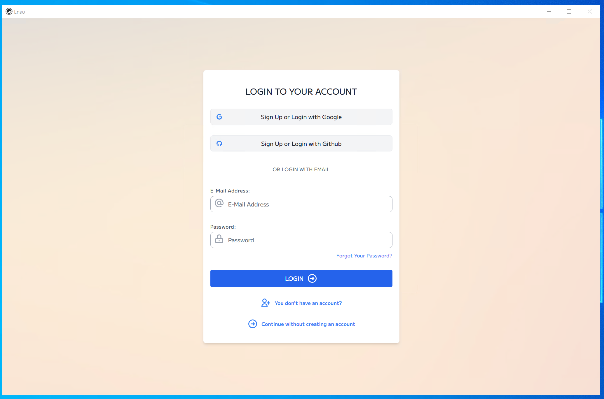
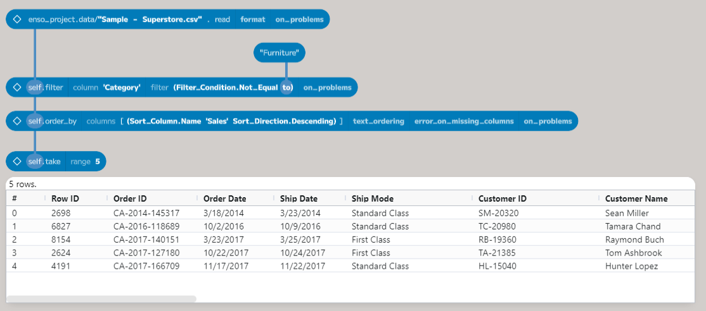

## Getting Started with Enso

In this post, I will use [Enso](https://enso.org) to read and process a CSV file. Enso is being designed and built to make it easier to process, blend and analyse data. It is a new programming language designed to have a dual representation both as text and as a visual graph.

The dataset used in this walkthrough is available from [Kaggle](https://www.kaggle.com/) [here](https://www.kaggle.com/datasets/vivek468/superstore-dataset-final). The goal of this post is to cover reading this data and finding the five highest-value furniture sales.

### Installing and Getting Started

Let's start by getting Enso installed. It will work on both Windows and Mac. This guide is based on Windows. You can download the installer from [here](https://github.com/enso-org/enso/releases/latest). Download the appropriate Enso IDE entry for your operating system and run it. 

*On Windows, you must have the Visual C++ Restributable installed. If you don't have it, you can download it from [here](https://support.microsoft.com/en-us/help/2977003/the-latest-supported-visual-c-downloads).*

Once the installation has been completed, you can launch Enso from the start menu or desktop shortcut. It may need to be approved by your firewall. Once it has started, you will see the following screen:

The login is optional, and there is an option at the bottom ("Continue without creating an account") to open the IDE without logging in. The login will be used in future for our cloud product and support chat, but you do not need it to use it locally.

If you do create an account or log in, then click on the "Local" button at the top to switch to running on your local machine. You will then see the following screen:

Click on the `New Project`` button, and it will create an empty new project and set up everything needed to run it. The first opening can take a little longer while it expands the runtime behind the scenes. Once it has finished, you will see the following screen with a single node:

### Reading in a File

The simplest way to bring data into Enso is to drag a file onto the IDE. The file will be copied into the project, and a node referencing it will be added to the graph:

Let's have a look at the code the node created: `enso_project.data/"Sample - Superstore_1.csv" . read`.

The first part, `enso_project`, is a variable referring to the current project. It has a few properties and methods on it. 

For now, we will look at the `data` method, which refers to a folder in the project where files can be stored and used efficiently. To call this method, use the `.` operator on `enso_project` followed by the method name. Projects in Enso are stored in your home directory (typically within `C:\Users\<Username>`) within a folder called `enso` and then `projects`. If you explore this folder and then go into `New_Project_1` (the default name for a first project), you will find a folder called `data` containing a file called `Sample - Superstore_1.csv` - the file dragged into the IDE.

To access the specific file within a folder, use the `/` operator followed by a text value with the name. In Enso, text values can be either in single quotes (`'`) or double quotes (`"`). If using single quotes, then escape characters such as `\n` and `\t` are interpreted. If using double quotes, then they are not. So `enso_project.data/"Sample - Superstore_1.csv"` returns a `File` object representing this.

To read the file into Enso, use the `read` method. The spaces around the `.` operator means that it will process the expression to the left first and then call `read` on the result. The read method will attempt to deduce the format automatically based on the extension. 

Now, take a quick look at the node itself:

To the left of the node are two icons. The first icon controls whether output nodes are "live" or disabled. This post will ignore this functionality. The second icon opens the visualisation of the node. In Enso, nodes are evaluated as you add or edit them, and you can use the visualisation to see the results as you work.

To the node's right, the variable name is shown (`operator2` in this case), where the result of the node is stored; you can use this name to refer to this node anywhere later in the graph.

Finally, within the node, you can see the code that was used to create it and placeholders for the two optional parameters of the `read` method (`format` and `on_problems`). If you hover your mouse over these (or the "Sample - Superstore_1.csv"), you will see a dropdown arrow at the bottom appear. If you click here, it will allow you to choose a value. 

*Note: We are currently working on a new version of the IDE, which will have widgets (such as the dropdowns) for all parameters, but for now, only some have them.*

## Filtering the Data

Now that the data is loaded, we can start to process it. The first thing is to filter the data to only include rows where the `Category` is `Furniture`. To do this, left-click on the `operator2` node and either press return or drag from the bottom edge to add a new node.

Doing this creates a new node and opens the component browser. The component browser allows you to search for methods to add to your graph. In this case, we are looking to filter the data, so either type `filter` or scroll up in the list to find the `filter` method. Click on it to add the method to the node. The component browser will search as you type, and you can press return when the required method is shown to add it.

The `filter` method takes two required parameters and one optional one. The first is the `column` within the table to filter, and the second is a `filter` condition to be checked. The optional parameter, `on_problems`, is a common argument to many functions specifying what to do if there are any problems with the data. For now, we will ignore this parameter. 

Click on the `column` parameter and then choose `Category` from the dropdown.

Next, click on the `filter` placeholder and choose `Equals`:

The filter node now needs a value for the right side of the equals condition. For this case, the goal is to filter when equal to `Furniture`. There are two ways to do this - edit the node and type value (I will cover this in another post) or add a new node providing a constant value of `Furniture`. To create this new node, click the `+` icon in the bottom left of the IDE. A new node is added, and the component browser is opened. In this case, type `"Furniture"` (please make sure to include the quotation marks in this node) and press return. You can then drag from the bottom of this node and connect it to the `to` placeholder within the filter node.

## Ordering and Selecting 5 Biggest Sales

Now that the data is filtered to the furniture orders, the next step is to order by the `Sales` column in descending order. The process is as before: press return to add a new node and search for the `order_by` method.

The `columns` parameter takes a list of columns to order by. To add an item to the list, click on the right-hand side of the placeholder (when a green plus is shown). A single entry will be added, with a dropdown from which the target column can be selected. In this case, choose `Sales (Desc)`. The `(Desc)` indicates that the column should be sorted in descending order. The added code defines a `Sort_Column`, which refers to the `Sales` column and specifies that it should be sorted in descending order.

The final step is to take the first five records. To do this, select the order by node and add a new node. If you type `take` it will show the method. You can either press enter at this point, and the method will be added, and you can configure it in similar ways to above. Alternatively, you can type `take 5` and press return, and it will add the new node selecting the required rows.

## Renaming the Project

The last thing to do is to rename the project. To do this, click on the second icon at the top left of the IDE, taking you back to the list of files. The left icon will open a home page with some templates, and the right icon will take you back to the graph editor you have been using.

Find the "New Project 1" entry and click the stop button. You can then rename it by using the right-click context menu or pressing Ctrl-R. Once renamed, you can click on the play button to reopen the project.

## Wrapping Up

In this post we worked through reading a CSV file and doing some initial data processing in Enso. Next time, we will dive into parsing data from some of the columns and aggregating the results.

I hope you will try out Enso and let us know what you think. If you have any questions, please join our [Discord](https://discord.com/invite/enso) server or comment below.
