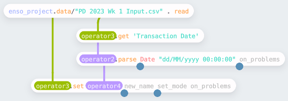
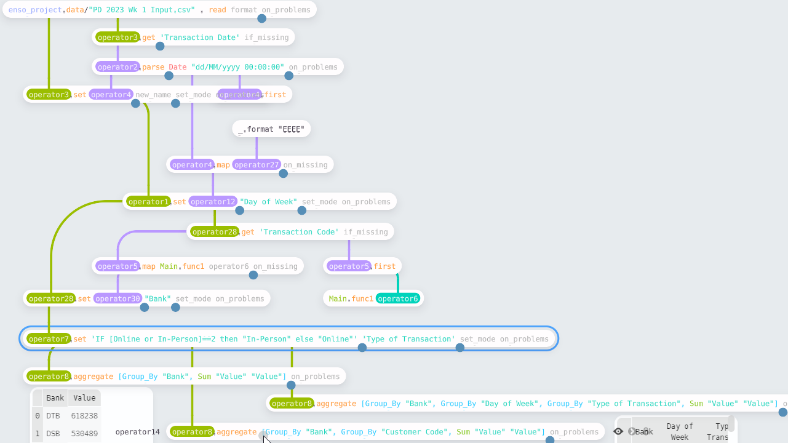

# Using Enso to Solve Preppin Data Challenges

Over the last 12 months, we have been working at [Enso](https://www.enso.org) towards the first release. Enso is a functional programming designed to let you easily load, blend and analyze your data. We've been building out the core capabilities and are rapidly working on the IDE and cloud release, and making the experience as easy as possible for users.

For this post, I tackled the first four challenges of 2023 posted on [Preppin Data](https://preppindata.blogspot.com/). These are data challenges posted by [Carl Allchin](https://twitter.com/datajedininja), [Jonathan Allenby](https://twitter.com/jonathanallenby), [Jenny Martin](https://twitter.com/jennymartinds14) and [Tom Prowse](https://twitter.com/TomProwse1). They are solvable in many data tools and make a good place to see how Enso is developing.

I am using a development build on my machine and many of the features and functions are still maturing and subject to change. We are still working on adding more and more "widgets" to the tools to help guide you through building the workflow and these will appear in the nightly builds over the next month or two.

Anyway, here is an summary of solving these problems.

## Week 1 - The Data Source Bank

- https://preppindata.blogspot.com/2023/01/2023-week-1-data-source-bank.html

Loading a dataset into Enso is as simple as dragging the file onto the IDE, and it will then set up the first node and attempt to parse the data. By default, Enso's CSV parsing only recognises dates in ISO format (`yyyy-MM-dd`). So to parse the 'Transaction Date' column we need to select column (using the `get` method) and then parse it (using the `parse` method). We then replace the column in the table with the `set` method.

For the challenge in this case we need to derive three values - the day of the week, the bank and whether it was in-person or online. For the first two, I used the same process - select the column, apply a function over each row and then set the result back. 

For the "day of week" the function is `_.format "EEEE"` (Enso uses Java for date and times so the [usual date format specifiers](https://docs.oracle.com/javase/8/docs/api/java/time/format/DateTimeFormatter.html) work). To build this, I got the `first` value of the column and then the component browser allows me to see the functions available on a `Date`. If you then detach the incoming node, the new node becomes a reusable function I can feed into the `map` function on the column.

For the "bank", it's a case of splitting the string and taking the first part. Again, I chose the input column ("Transaction Code") and got the first element. Then using a `split` node and `first` node I can get the part of the text.

Having built these nodes, Enso allows me to make a reusable function by selecting them and pressing `Ctrl-G`. The function can then be fed into the same `map` as above.

For the final column, I chose to use Enso expression syntax. This is a Excel like formula syntax that allows for a short hand to derive a new column. You can reference existing columns (specified by name in square brackets) and has ability to use all the functionality defined on a column. In this case, `'IF [Online or In-Person]==2 then "In-Person" else "Online"'` will decode the column into the text values.

Finally, the last task is to aggregate the results to make 3 new tables. The `aggregate` function on the table allows us to do this. It takes a vector of columns to produce the summarised tables. These columns are either group bys or aggregations. For example, `operator8.aggregate [Group_By "Bank", Group_By "Day of Week", Group_By "Type of Transaction", Sum "Value" "Value"]`.

The final workflow looks like:

[Code](https://gist.github.com/jdunkerley/44d0e1f66fedad1223a3a08bd44c440d)

## Week 2- 

