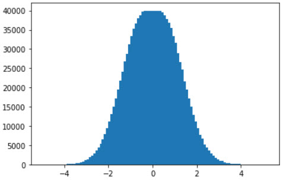
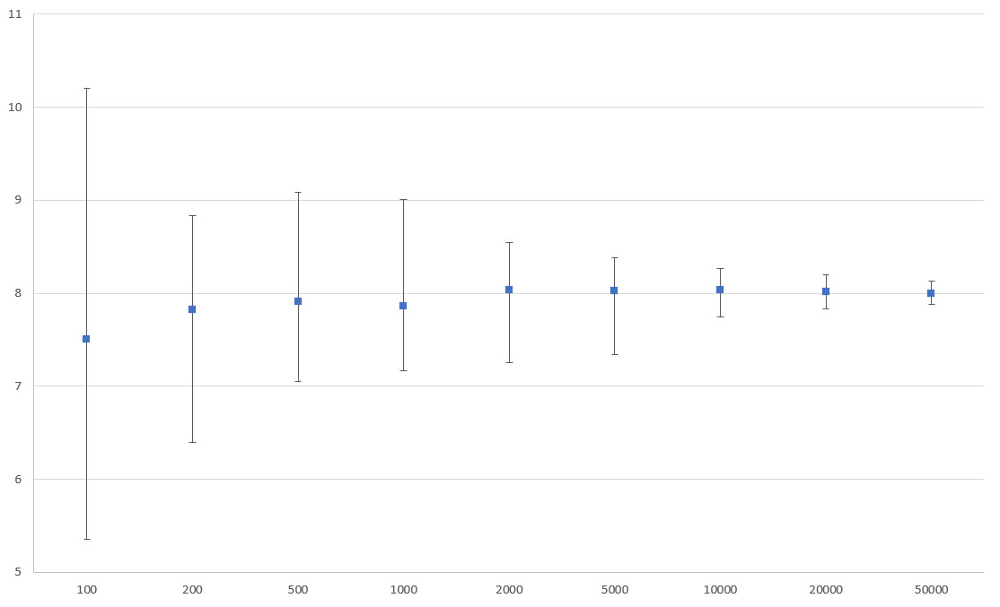

# Monte-Carlo Pricing of Barrier Options in Python

Monte-Carlo simulation is a very useful technique in quantitative finance. The core premise is to use a random process to generate lots of simulations and using these to value complex instruments. The advantage of this technique is often doesn't involve advanced maths to be able to do this, and all you need to do to improve accuracy is run more simulations.

This post will take the simple example of pricing a knock-out barrier option by simulating the underlying price. The code will built up in python starting with a simple naive approach and improving it to produce a reasonably fast implementation.

## What is a Knock-Out Barrier Option?

The simplest types of options are vanilla options - these give the holder the right, but not obligation, to buy (a Call option) or sell (a Put option) an underlying security, such as a stock or foreign exchange rate, at an agreed price (Strike, *K*) either before (an American option) or on (a European option) a specific date (Expiry date). This post will just look at European expiry as that will keep things simpler, though the simulation approach easily allows for modelling American or more exotic expiry types.

The final value of an option, the option's payoff, is dependent on the price (spot price, *S*) of the underlying at expiry is given by `MAX(0, S-K)` for a Call and `MAX(0, K-S)` for a Put. In order to work out the current fair value of an option, we need a couple more things: the expected value of *S*, *E(S)*, at expiry in time *t*, and the risk free interest rate, *r*. The fair value of an option is given by:


In this case, a simulation can be used to estimate the value of *E(S)*. Using this to then estimate the fair value of the option. There is a closed-form formula for pricing these options, the Black-Scholes model, which we can use to check the validity of the output of the simulation.


A barrier option adds an extra complication by adding a price level at which if the price breaks the option is either cancelled (a knock-out) or has no value before (a knock-in). These options are described as path dependent because the final payout is dependent on the underlying prices prior to expiry as well as the final price. 

Again there are closed formed equations for this create by Merton (1973) and Reiner and Rubenstein (1991). These are significantly more complicated and beyond the scope of this post.

## Simulating the Underlying Price

Within Black-Scholes model, the value of the underlying is modeled as if it follows [geometric Brownian motion](https://www.quantstart.com/articles/Geometric-Brownian-Motion/), . We can simulate this process by creating a change in S, , for small change in t,  (while the maths for this is not too complicated it is beyond the scope of this post):


The  value is a random number drawn from a standard Normal distribution. The smaller the value of  the smaller the error in the approximation to the true random walk. 

The first step in the implementation is to generate such a random number:

```python
from random import random
from math import sqrt, log

def box_muller_rand():
    while True:
        x = random() * 2.0 - 1
        y = random() * 2.0 - 1
        d = x * x + y * y 
        if d < 1:
            return x * sqrt(-2 * log(d) / d)
```

This is a simple implementation of the [Box Muller](https://en.wikipedia.org/wiki/Box%E2%80%93Muller_transform) transformation which takes two uniform random numbers and produces a normally distributed one. As a simple test, we can generate a 1,000,000 numbers using this and see how it is distributed:

```python
import matplotlib.pyplot as plt

bins = { }
for i in range(1000000):
    num = round(box_muller_rand(), 1)
    bins[num] = bins.get(num, 0) + 1

plt.bar(bins.keys(), bins.values())
plt.show()
```



Next, is to create a function to generate a path for S:

```python
def create_path(initial, time, steps, volatility, risk_free):
    dt = time / steps
    sdt = sqrt(dt)

    path = []
    current = initial
    for i in range(steps):
        path.append(current)
        current = current * exp((risk_free - 0.5 * volatility * volatility) * dt + volatility * sdt * box_muller_rand())
    
    return path
```

Below is a generated 20 paths 365 steps for a time of 1, with an initial price of 100, volatility of 10% and risk free rate of 1%:

```python
paths = []
x = [x / 100 for x in range(365)]
for i in range(20):
    paths.append(create_path(100, 1, 365, 0.1, 0.01))
    plt.plot(x, paths[-1])
```


## Pricing an Option

Now, we have the ability to generate a path. To price an option we want to generate a set of paths and determine the value of the option at the end and then discount back to the present value on each path. We can then estimate the current value of the option by averaging the output. Something like:

```python
def price_option(strike, spot, time, volatility, risk_free, call_or_put='c', knockin=None, knockout=None, simulations=2000, steps_per_unit = 365):
    if knockin and knockout:
        raise Exception("Unable to cope with 2 barriers!")

    cp = 1 if call_or_put == 'c' else -1

    premiums = []
    for i in range(simulations):
        path = create_path(spot, time, time * steps_per_unit, volatility, risk_free)
        if knockin and knockin > spot and max(path) < knockin: # Up and In
            premiums.append(0)
        elif knockin and knockin < spot and min(path) > knockin: # Down and In
            premiums.append(0)
        elif knockout and knockout < spot and min(path) < knockin: # Down and Out
            premiums.append(0)
        elif knockout and knockout > spot and max(path) > knockout: # Up and Out
            premiums.append(0)
        else:
            premiums.append(max(0, cp * (path[-1] - strike)))

    return sum(premiums) / simulations * exp(-time * risk_free)
```

So let's test it pricing a 105 strike 1 year call option with a spot of 100, volatility of 20% and risk free of 5%:

```python
spot=100
strike=105
vol=0.2
risk_free=0.05
price_option(strike, spot, 1, vol, risk_free)
```

In my test run (with 2,000 simulations and 365 steps), this came out as about 7.41. Using a [Black-Scholes pricer](https://goodcalculators.com/black-scholes-calculator/), this should be 8.02. So quite an error. The more simulations, we run the closer result should be. The chart below shows running pricing the option 20 times at different numbers of simulation and then shows the range of results and the average:



As you can see the uncertainty in the pricing decreases as the number of runs increases. The problem is the time taken goes up! With the current code running 50,000 simulated paths this code takes 15.2 seconds.

## Performance Tuning

Currently, to generate 50,000 simulations each with 365 points, we need to call the `box_muller_rand` function more than 18 million times. So performance of this function is critical to the pricing function. Python is an interpreted language but there is a library called [numba](http://numba.pydata.org/) which allows for just in time compilation within python. Numba can't deal with everything in python but it can cope with a lot of mathematical computations. If we add the `njit` decorator to the function then Numba will compile the function on first call can then use the compiled version. It's worth noting that you pay a cost on the first execution but then it is a lot quicker:

```python
from numba import njit

@njit(fastmath=True)
def box_muller_rand():
    while True:
        x = random() * 2.0 - 1
        y = random() * 2.0 - 1
        d = x * x + y * y 
        if d < 1:
            return x * sqrt(-2 * log(d) / d)
```

Having put this in, the execution time for pricing at 50,000 simulations is now 5.2s. Normally, moving to a built-in function will speed things up so lets try using `numpy.random.normal`. If we just put that into the create_path function instead of the `box_muller_rand` call then it is much slower ()