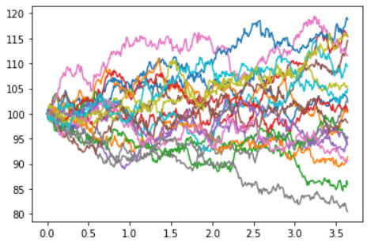

# Monte Carlo Pricing of Barrier Options in Python

Monte Carlo simulation is a very useful technique in quantitative finance. The core premise is to use a random process to generate a lot simulations and using these simulation to value complex instruments. This post will take the simple example of pricing a knock-out barrier option by simulating the underlying price. The implementation will built up in python starting with a simple naive approach and attempting to produce a reasonably fast implementation.

## What is a Knock-Out Barrier Option?

The simplest types of options are vanilla options - these give the holder the right, but not obligation, to buy (a Call option) or sell (a Put option) an underlying security, such as a stock or foreign exchange rate, at an agreed price (Strike, *K*) either before (an American option) or on (a European option) a specific date (Expiry date). This post will just look at European expiry as that will keep things simpler. The final value of an option, the option's payoff, is dependent on the price (spot price, *S*) of the underlying at expiry is given by `MAX(0, S-K)` for a Call and `MAX(0, K-S)` for a Put.

In order to work out the current fair value of an option, we need two things the expected value of *S*, *E(S)*, at expiry in time *t*, and the risk free interest rate, *r*. The fair value of an option is given by `premium=payoff(E(S))e^-rt`. In this case, a simulation can be used to estimate the value of *E(S)* and hence the fair value of the option. There is a formula for pricing these options, the Black-Scholes model, which we can use to check the output of the simulation.


A barrier option adds an extra complication by adding a price level at which if the price breaks the option is either cancelled (a knock-out) or has no value before (a knock-in). These options are described as path dependent because the final payout is dependent on the underlying prices prior to expiry as well as the final price. Again there are closed formed equations for this create by Merton (1973) and Reiner and Rubenstein (1991). These are significantly more complicated 

## Simulating the Underlying Price

Within Black-Scholes model, the value of the underlying is modeled as if it follows a lognormal random walk , . We can simulate this process by creating a change in S, , for small change in t, : . The  value is a random number drawn from a standard Normal distribution. The smaller the value of  the smaller the error in the approximation to the true random walk. 

The first step in the implementation is to generate such a random number:

```python
from random import random
from math import sqrt, log, cos, pi, exp

def box_muller_rand():
    return sqrt(-2 * log(random())) * cos(2 * pi * random())
```

This is a simple implementation of the [Box Muller](https://en.wikipedia.org/wiki/Box%E2%80%93Muller_transform) transformation which takes two uniform random numbers and produces a normally distributed one. As a simple test, we can generate a 1,000,000 numbers using this and see how it is distributed:

```python
import matplotlib.pyplot as plt

bins = { }
for i in range(1000000):
    num = round(box_muller_rand(), 1)
    bins[num] = bins.get(num, 0) + 1

plt.bar(bins.keys(), bins.values())
plt.show()
```


Next, is to create a function to generate a path for S:

```python
def create_path(initial, time, steps, volatility, risk_free):
    dt = time / steps
    sdt = sqrt(dt)

    path = []
    current = initial
    for i in range(steps):
        path.append(current)
        current = current * exp((risk_free - 0.5 * volatility * volatility) * dt + volatility * sdt * box_muller_rand())
    
    return path
```

Below is a generated 20 paths 365 steps for a time of 1, with an initial price of 100, volatility of 10% and risk free rate of 1%:

```python
paths = []
x = [x / 100 for x in range(365)]
for i in range(20):
    paths.append(create_path(100, 1, 365, 0.1, 0.01))
    plt.plot(x, paths[-1])
```



## Pricing an Option

```python
def price_option(strike, spot, time, volatility, risk_free, call_or_put='c', knockin=None, knockout=None, simulations=2000, steps_per_unit = 365):
    if knockin and knockout:
        raise Exception("Unable to cope with 2 barriers!")

    cp = 1 if call_or_put == 'c' else -1

    premiums = []
    for i in range(simulations):
        path = create_path(spot, time, time * steps_per_unit, volatility, risk_free)
        if knockin and knockin > spot and max(path) < knockin: # Up and In
            premiums.append(0)
        elif knockin and knockin < spot and min(path) > knockin: # Down and In
            premiums.append(0)
        elif knockout and knockout < spot and min(path) < knockin: # Down and Out
            premiums.append(0)
        elif knockout and knockout > spot and max(path) > knockout: # Up and Out
            premiums.append(0)
        else:
            premiums.append(max(0, cp * (path[-1] - strike)))

    return sum(premiums) / simulations * exp(-time * risk_free)
```