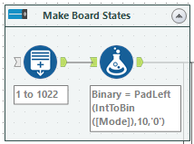
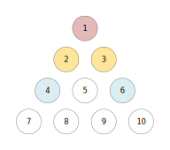
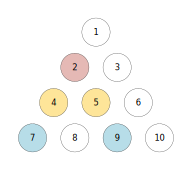
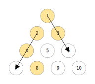
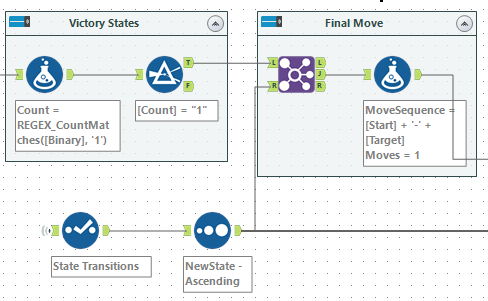
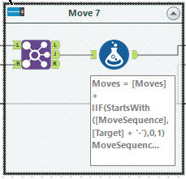

# Solving Matt Parker's Coin Puzzle in Alteryx

Matt Parker is publishing a weekly puzzle on his [Think Maths](https://www.think-maths.co.uk/) website every Wednesday. This week's puzzle was a [Coin Puzzle](https://www.think-maths.co.uk/coin-puzzle).

<iframe width="560" height="315" src="https://www.youtube.com/embed/TEkJMFTyZwM" frameborder="0" allow="accelerometer; autoplay; encrypted-media; gyroscope; picture-in-picture" allowfullscreen></iframe>

This puzzle felt like one that Alteryx would be well suited to solving.

## Representing the Board's State

The board looks like:


Each location can either have a coin or not have a coin. This means a binary representation is straight forward. Keeping the numbering order the same I choose to have 1 be the first bit through to 10 being the 10th bit. So a board like:


Would be encoded to the number of 662:

|Position|1|2|3|4|5|6|7|8|9|10|Total|
|---|---|---|---|---|---|---|---|---|---|---|---|
|Coin|0|1|1|0|1|0|0|1|0|1|**5**|
|Decimal Value|1|2|4|8|16|32|64|128|256|512|**662**|

Additionally, we can now create all the possible states of the board by running through every number from 1 to 1022. We can ignore the completely empty board (state 0) and completely full board (start 1023). Our goal is to get to a state where only one bit is set.



Using a [Generate Rows](https://help.alteryx.com/current/designer/generate-rows-tool) tool to create a sequence from 1 to 1022 and then feeding this into a [Formula](https://help.alteryx.com/current/designer/formula-tool) tool to create the binary representation. The function I used was:

```
ReverseString(PadLeft(IntToBin([Mode]),10,'0'))
```

I chose to reverse the binary representation so character 1 of the string represents coin 1.

## Legitimate Moves

Next, want to consider the set of possible moves. The board is very symmetrical so if we look at moving 1 it's like looking at 7 and 10 as well. Likewise, 2 is like looking at 3, 4, 6, 8 and 9. And finally, we have 5 to look at.



Coin 1 can only jump to either 4 or 6 and only if 2 or 3 are occupied respectively. All other moves are either not in a straight line or exceed the bounds of the board.



Coin 2 can only jump to either 7 or 9 and only if 4 or53 are occupied respectively.

Finally, coin 5 cannot itself jump anywhere without exceeding the bounds of the board.

We can now build an entire set of all legitimate moves:

|Start|Moves (Start - Jump - End)|
|---|---|
|1|1-2-4, 1-3-6|
|2|2-4-7, 2-5-9|
|3|3-5-8, 3-6-10|
|4|4-2-1, 4-5-6|
|5||
|6|6-3-1, 6-5-4|
|7|7-4-2, 7-8-9|
|8|8-5-3, 8-9-10|
|9|9-5-2, 9-8-7|
|10|10-6-3, 10-9-8|

## State Transitions


What I chose to do was compute all the states that each state could move to. The first part of this was to break each state into 10 rows for every state with a 1 or 0 to show if a coin is present in each cell.


After this a sequence of joins allows you to work out the legitimate moves. First, join the cells with a coin to the start of a move. Then join the jump cell with the an occupied cell. And then final join the target cell with an empty cell. Having done this we end up with a table of State, Start, Jump, Target of all possible starting states and moves. The diagram below shows the state of board for a random state and the possible moves:



Finally, using a formula tool to compute the new state of the board:

```
State-Pow(2,[Start]-1)-Pow(2,[Jump]-1)+Pow(2,[Target]-1)
```

## Computing Plays

Now we need to work out the sequence of plays. I chose to run the sequence backwards. Start with the end state and reverse moves until you find an initial state. As I was being lazy I repeated blocks rather than an iterative macro but this seemed a simple solution given scale of the problem.



To compute final states, I used a `REGEX_CountMatches` expression to count the 1s. A final state will be an *integral non-negative power of 2* and so will have a single 1 in the binary representation. We can then join the state transition to produce the possible last moves. For tracking the sequence of moves, I create two additional columns `Moves` and `MoveSequence`. Moves will count the number of separate moves and MoveSequence will track the moves made.



We then need to make 7 more back steps. Each of these steps is identical. They take the current possible set of plays until this point and the state transitions and produces the next set of plays. If the `Target` of the new move is equal to the `Start` of the current move then we don't increment the `Moves` count otherwise we add 1. The expression I used was:

```
[Moves] + IIF(StartsWith([MoveSequence],[Target] + '-'),0,1)
```

Having repeated this 6 more times, we end up with the 84 possible plays which win the game. The last step is to choose the lowest Moves and then we are done.

## Wrap Up

As always it is a lot of fun to challenge the bounds of what is possible within Alteryx. This was a nice puzzle and had some interesting challenges to build it quickly. 

I'm not posting my sequence here but if you run the workflow it will give you the answer. The workflow is available on [DropBox](https://www.dropbox.com/s/9wu1w5obe41o8a6/MPMP%205.yxmd?dl=0)